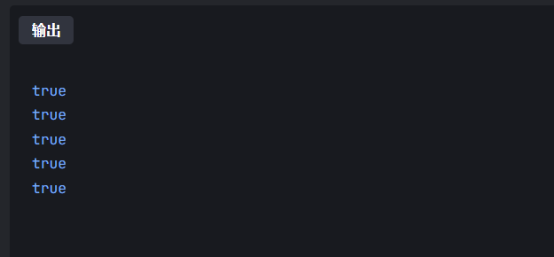

## 基本数据结构

c++、

大根堆

```c++
priority_queue<int> heap;
```

小根堆

```c++
priority_queue<int,vector<int>,greater<int>> heap;
```


go语言

很多数据结构需要自己手动实现


堆的数据结构

```go
type hp []*ListNode
func (h hp) Less (i, j int) bool{
    return h[i].Val < h[j].Val
}
func (h hp) Len () int {
    return len(h)
}

func (h hp) Swap(i,j int) {
    h[j], h[i] = h[i], h[j]
}

func (h *hp) Push(v any) {
    *h = append(*h, v.(*ListNode))
}

func (h *hp) Pop() any {
    a := *h
    v := a[len(a) - 1]
    *h = a[:len(a) - 1]
    return v
}

//初始化后一定要有一个入堆的操作，后面全部都用heap
```


图的存储

```go
N = 100010
e = make([]int, 2*N)
h = make([]int, N)
ne = make([]int, 2*N)

func add(a, b int) {
    e[idx] = b
    ne[idx] = h[a]
    h[a] = idx
    idx++
}
```


## 二叉树

输入的时候都是一个点的左右子树是啥：

样例为：

```
6
2 5
3 4
6 0 
0 0
0 0
0 0
```

### 静态存储和遍历(已经给出每次的左右两边)

这里采用静态数组的思想。

开一个数组tree和一个数组der，首先用来存储的

tree用来存储节点的值，der用来存储节点的左右子树对应的索引

```c++
#include <iostream>
using namespace std;
const int N = 100010,M = 4*N;
int trees[M],der[N];
int n;
void dfs(int u)
{
    if(trees[u]) printf("%d ",trees[u]);
    if(trees[2*u]) dfs(2*u);
    if(trees[2*u+1]) dfs(2*u+1);
}
int main() {
    scanf("%d",&n);
    //首先确定根节点
    trees[1] = 1;
    der[1] = 1;
    for(int i = 1;i<=n;i++)
    {
        int l,r;
        scanf("%d%d",&l,&r);
        trees[2*der[i]] = l;
        trees[2*der[i]+1] = r;
        der[l] = 2*der[i];
        der[r] = 2*der[i]+1;
    }
    //进行递归输出
    dfs(1);

    return 0;
}

```

上面就可以完存储和遍历

### 深度求解

直接就是dfs，然后记录每次遍历的深度节点

每一次都是取得左右子树最大的值和本次的节点进行相加

```c++
/*
 *
 *  给你一个不超过100位的数n，和一个不超过100的数字k，要求从数n中去掉k个数字，然后使得去掉k个数之后，n最小。
 * */


#include <iostream>
using namespace std;
const int N = 100010,M = 4*N;
int trees[M],der[N];
int n;
int dfs(int u)
{
    int sum = 1;
    if(trees[u]) printf("%d ",trees[u]);
    int left = 0,right = 0;
    if(trees[2*u]) left = dfs(2*u);
    if(trees[2*u+1]) right =  dfs(2*u+1);
    sum += max(left,right);
    return sum;
}
int main() {
    scanf("%d",&n);
    //首先确定根节点
    trees[1] = 1;
    der[1] = 1;
    for(int i = 1;i<=n;i++)
    {
        int l,r;
        scanf("%d%d",&l,&r);
        trees[2*der[i]] = l;
        trees[2*der[i]+1] = r;
        der[l] = 2*der[i];
        der[r] = 2*der[i]+1;
    }
    //进行递归输出
    int ans = dfs(1);
    cout<<endl;
    cout<<"shendu: ";
    cout<<ans<<endl;

    return 0;
}

```


### 二叉树的遍历

递归的本质数学原理：是数学归纳法

####  3598. 二叉树遍历 （已知前和中，求出后序）  

substr第一个是开始的位置，第二个是==长度，如果没有说明就是全部==。

```c++
#include <iostream>
#include <cstring>
#include <algorithm>
using namespace std;

//递归建树
void dfs(string pre,string in)
{
    //判断递归是否可以暂停
    if(pre.empty()) return ;
    char root  = pre[0];
    int k = in.find(root);//从中序中寻找到根节点的位置
    dfs(pre.substr(1,k),in.substr(0,k));
    dfs(pre.substr(k+1),in.substr(k+1));
    cout<<root;
}

int main()
{
    string pre,in;
    while(cin>>pre>>in)
    {
        //递归进行建树
        dfs(pre,in);
        puts(" ");
    }
    return 0;
}
```


#### P1030.求先序排列 （已知后序和中序）

用递归的基本思想，其实跟前序和中序来定是一模一样的思路，只是要注意好dfs中的内容和定下来的次序存在差别

```c++
#include<iostream>
#include<string>
#include<cstring>
#include<algorithm>
using namespace std;
string in,beh;
void dfs(string in,string beh){
    if(in.empty()) return;
    int index = beh.size()-1;
    char root = beh[index];
    int k = in.find(root);
    printf("%c",root);
    dfs(in.substr(0,k),beh.substr(0,k));
    dfs(in.substr(k+1),beh.substr(k,index-k));
}

int main()
{
    cin>>in>>beh;
    dfs(in,beh);
    puts(" ");
    return 0;
}
```


#### 已知前序中序，进行二叉树深度求解

```c++
#include<iostream>
#include<algorithm>
#include<cstring>

using namespace std;

int dfs(string pre ,string in)
{
    if(pre.empty()) return 0;
    int sum = 1;
    char root = pre[0];
    int k = in.find(root);
    int left = dfs(pre.substr(1,k),in.substr(0,k));
    int right = dfs(pre.substr(k+1),in.substr(k+1));
    sum += max(left,right);
    return sum;
}

int main()
{
    string pre,in;
    while(cin>>pre>>in)
    {
        cout<<dfs(pre,in);
        puts(" ");
    }
    return 0;
}
```

#### 求解多叉树的深度

给出一个多叉树(多于二叉)的先序遍历和后序遍历，(每个节点以字符串标识)，求该树的深度。没有数据范围

这个题目将后序遍历的字串进行逆序后，转化为前后字串求最长公共子串的问题。

==逆序后，求最大公共子串==！

```c++
/*
ABCDEFGH
CEFDBHGA
*/
#include<iostream>
#include<algorithm>
#include<cstring>
#include<string>
using namespace std;
const int N = 10010;
int f[N][N];
string pre,beh;
int main()
{
    cin>>pre>>beh;
    int n = pre.size();
    reverse(beh.begin(),beh.end());//是reverse
    //之前的那个模板题里面，是从1开始进行计数的，所以是比较a[i]==b[j]
    for(int i = 1;i<=n;i++)
    {
        for(int j = 1;j<=n;j++)
        {
            f[i][j] = max(f[i-1][j],f[i][j-1]);
            if(pre[i-1] == beh[j-1]) f[i][j] = max(f[i][j],f[i-1][j-1]+1);
        }
    }
        
    printf("%d\n",f[n][n]);
    return 0;
}


```

## dfs专项

要注意是否需要恢复现场、

如果是仅遍历一次，那就不需要


### 基本的dfs

#### 排列数字

```c++
#include<iostream>
using namespace std;
int n;
const int N = 10;
bool st[N];
int path[N];

void dfs(int u){
    if(u==n){
        for(int i = 0;i<n;i++) printf("%d ",path[i]);
        puts("");
    }
    
    for(int i = 1;i<=n;i++){
        if(!st[i]){
            path[u] = i;
            st[i] = true;
            dfs(u+1);
            st[i] = false;
            path[u] = 0;
        }
    }
}
int main()
{
    cin>>n;
    dfs(0);
    return 0;
}	
```

go版本

```go
package main

import "fmt"

var path = make([]int, 10)
var n = 0
var st = make([]bool, 10)
func dfs(cur int){
    if cur == n {
        for i:=0 ;i < n;i++ {
            fmt.Printf("%d ", path[i])
        }
        fmt.Printf("\n")
    }
    for i:=1; i <= n;i++ {
        if !st[i] {
            path[cur] = i
            st[i] = true
            dfs(cur + 1)
            path[cur] = 0
            st[i] = false
        }
    }
    
}

func main(){
    fmt.Scanf("%d", &n)
    dfs(0)
}
```


#### 树的重心（dfs暴力搜索）

```c++
#include<iostream>
#include<algorithm>
#include<cstring>
using namespace std;
int n;
const int N = 100010,M = 2*N;
int h[N],ne[M],e[M],idx=0;
bool st[N];
int ans = N;
void add(int a,int b){
    e[idx] = b;
    ne[idx] = h[a];
    h[a] = idx++;
}
//以u为根中点的子树的数量
int dfs(int u){
    int sum = 1,res = 0;
    st[u] = true;
    for(int i = h[u];i!=-1;i=ne[i]){
        int j = e[i];
        if(!st[j]){
            //子树的数量
            int s = dfs(j);
            res = max(s,res);
            sum+=s;
        }
    }
    res = max(res,n-sum);
    ans = min(ans,res);
    return sum;//返回的是子树的点数
}

int main()
{
    scanf("%d",&n);
    memset(h,-1,sizeof h);
    for(int i =0;i<n-1;i++)
    {
        int x,y;
        scanf("%d%d",&x,&y);
        add(x,y);
        add(y,x);//无向边要加两次
    }
    dfs(1);
    printf("%d\n",ans);
    return 0;
}
```


go版本

```go
package main

import (
    "fmt"
    "os"
    "bufio"
    )
var(
    idx = 0
    N = 100010
    e = make([]int, 2*N)
    h = make([]int, N)
    ne = make([]int, 2*N)
    n = 0
    st = make([]bool, N)
    ans = 400000
    )
func add(a, b int) {
    e[idx] = b
    ne[idx] = h[a]
    h[a] = idx
    idx++
}

func dfs(u int) int {
    st[u] = true
    size := 0
    sum := 0
    for i := h[u]; i != -1 ; i = ne[i] {
        j := e[i] 
        if st[j] {
            continue
        }
        s := dfs(j)
        size = max(size, s)
        sum += s
    }
    size = max(size, n - sum - 1)
    ans = min(ans, size)
    return sum + 1
}

func main() {
    reader := bufio.NewReader(os.Stdin)
    fmt.Fscan(reader, &n)
    for i := 1; i <= n; i++ {
        h[i] = -1
    }
    for i := 0; i < n - 1; i++ {
        a, b := 0, 0
        fmt.Fscan(reader, &a, &b)
        add(a, b)
        add(b, a)
    }
    dfs(1)
    fmt.Println(ans)
}
func max(a, b int) int {
    if a > b {
        return a
    }
    return b
}

func min(a, b int) int {
    if a < b {
        return a
    }
    return b
}
```


#### 洛谷  P1036 选数

dfs暴搜每一种可能，然后所有的结果，判断是不是质数，然后有重复的。去重

```c++
#include<iostream>
using namespace std;
const int N = 25;
int n,k;
int a[N];
bool st[N];
int path[N];
int ans = 0;
int get_prim(int x)
{
    if(x==2 || x ==3) return 1;
    for(int i =2;i<x/i;i++)
    {
        if(x%i==0){
            return 0;
        }
    }
    return 1;
}
void dfs(int u)
{
    if(u==k){
        int sum = 0;
        for(int i = 0;i<k;i++){
            sum += path[i];
        } 
        if(get_prim(sum)) ans++;
        return ;
    }
    
    for(int i = 0;i<n;i++)
    {
        if(!st[i])
        {
            st[i] = true;
            path[u] = a[i];
            dfs(u+1);
            st[i] = false;
            path[u] = 0;
        }
    }
}

int main()
{
    scanf("%d%d",&n,&k);
    for(int i = 0;i<n;i++) scanf("%d",&a[i]);
    dfs(0);
    int s = 1;
    while(k){
        s*=k;
        k-=1;
    }
    printf("%d\n",ans/s);
    return 0;
}
```

#### 塔子：p1233组合

```c++
#include<iostream>
#include <unordered_map>
using namespace std;
int a[5];
bool st[5];
int path[5];
int ans = 0;
void dfs(int u,unordered_map<int,int>& hash){
    if(u==3){
        int x = path[0]*100+path[1]*10+path[2];
        hash[x]++;
        if(hash[x]==1) ans++;
        return;
    }
    for(int i = 0;i<4;i++)
    {
        if(!st[i]){
            st[i] = true;
            path[u] = a[i];
            dfs(u+1,hash);
            st[i] = false;
            path[u] = 0;
        }
    }
}
int main()
{
    for(int i = 0;i<4;i++) scanf("%d",&a[i]);
    unordered_map<int,int> hash;
    dfs(0,hash);
    printf("%d\n",ans);
    return 0;
}
```

这里需要注意，hash的传递需要使用引用传递，不然默认的话是值传递，导致hash为空，无法达到去重。


### Flood Fill问题（洪水泛滥算法）


### DFS之连通性模型（不需要恢复现场）

其实这个题目也可以使用bfs来做，但是还是要去训练dfs。

一开始没有ac的原因就是因为没有正确的读入g矩阵。

#### 迷宫  1112 （返回的是可达性）

```c++
#include<iostream>
#include<cstring>
using namespace std;
const int N = 110;
int a1,a2,b1,b2;
char g[N][N];
bool st[N][N];
int n;
int dx[4] = {0,0,-1,1};
int dy[4] = {1,-1,0,0};

bool dfs(int x,int y)
{
    if(g[x][y]=='#') return false;
    if(x==b1 && y == b2) return true;
    st[x][y] = true;
    for(int i = 0;i<4;i++)
    {
        int _x = x+dx[i],_y = y+dy[i];
        if(_x<0 || _x >=n || _y<0 || _y >=n) continue;
        if(st[_x][_y]) continue;
        if(dfs(_x,_y)) return true;
    }
    //什么都没有搜索到就是false
    return false;
}
int main()
{
    int k;
    scanf("%d",&k);
    while(k--)
    {
        scanf("%d",&n);
        memset(st,0,sizeof st);
        for (int i = 0; i < n; i ++ ) scanf("%s", g[i]);
        scanf("%d%d%d%d",&a1,&a2,&b1,&b2);
        if(dfs(a1,a2)) puts("YES");
        else puts("NO");
    }
    return 0;
}
```


#### 红与黑 1113 （洪水泛滥，返回的是经过的点数）

==md老是忘记清理st每次==。

```c++
#include<iostream>
#include<cstring>
using namespace std;
int h,w;
const int N = 25;
char g[N][N];
int dx[4] = {0,0,1,-1};
int dy[4] = {1,-1,0,0};
bool st[N][N];

//返回和他联通点的数量
int dfs(int x,int y){
    int sum = 1;
    st[x][y] = true;
    //这里其实不需要提前进行判断，因为一开始可以出现走的地方一定不在#处
    for(int i = 0;i<4;i++)
    {
        int a = x+dx[i],b = y+dy[i];
        if(a<0 || a>= h || b<0 ||b>=w) continue;
        if(g[a][b]!='.') continue;
        if(st[a][b]) continue;
        int s = dfs(a,b);
        sum  += s;//这个地方其实也很好想，就是要和子递归可以到达的地方做加法
    }
    return sum;
}
int main()
{
    while(scanf("%d %d",&w,&h)!=EOF)
    {
        if(w==0 && h ==0) break;
        for(int i = 0;i<h;i++) scanf("%s",&g[i]);
        int ax,ay;
        memset(st,0,sizeof st);
        for(int i = 0;i<h;i++)
        {
            for(int j = 0;j<w;j++)
            {
                if(g[i][j]=='@'){
                    ax = i;
                    ay = j;
                    break;
                }
            }
        }
        cout<<dfs(ax,ay)<<endl;
    }
    return 0;
}
```

### dfs暴搜+剪枝

#### 165 小猫爬山

- 一开始可能会觉得是一个背包问题，但是n特别小，其余的非常大，考虑用dfs做。
- 暴搜最重要是注意顺序，需要我们不重复不遗漏


剪枝优化的一般的策略：

1.优先 考虑决策少的元素：使得靠近树枝的元素就会少一点，方便break

2.有一些明显不可以到的地区，我们直接跳出

```c++
#include<iostream>
#include<algorithm>
using namespace std;
const int N = 20;
int n,m;
int w[N];//小猫的重量
int s[N];//缆车的重量
int ans = N;
bool cmp(int a,int b){
    return a>b;
}
//如何确保不重不漏的，题目要求所有的猫，然后就是车
void dfs(int u,int k ){
    //剪枝优化，比ans大的就没有必要继续递归下去了
    if(k>= ans) return ; 
    if(u == n){
        ans = k;
        return ;
    }
    //让小猫上原有的车
    for(int i = 0;i<k;i++){
        if(w[u]+s[i]<=m){
            s[i]+=w[u];
            dfs(u+1,k);
            //一定要注意，回退的时候需要恢复现场，因为回退说明小猫没有上车
            s[i]-=w[u];
        }
    }
    //单独给小猫开一个车
    s[k] = w[u];
    dfs(u+1,k+1);
    s[k] = 0;
    
    
}
int main()
{
    scanf("%d%d",&n,&m);
    for(int i = 0;i<n;i++) cin>>w[i];
    sort(w,w+n,cmp);
    dfs(0,0);
    printf("%d\n",ans);
    return 0;
}
```


## 动态规划专区

y总：其实就是对于暴搜的优化

### 1.背包问题（按照不同的选法来分类）

#### 01背包

==注意下标要从1开始==。

朴素分析法：


```c++
#include<iostream>
#include<algorithm>
using namespace std;
const int N = 1010;
int v[N],w[N];
int n,m;
int f[N][N];//f表示的是价值最大的东西
int main()
{
    scanf("%d%d",&n,&m);
    for(int i = 1;i<=n;i++)
    {
        scanf("%d %d",&v[i],&w[i]);
    }
    for(int i = 1;i<=n;i++)
    {
        for(int j = 0;j<=m;j++)
        {
            f[i][j] = f[i-1][j];
            if(j>=v[i]){
                f[i][j] = max(f[i][j],f[i-1][j-v[i]]+w[i]);
            }
        }
    }
    printf("%d\n",f[n][m]);
    return 0;
}
```

优化后的版本。

```c++
#include<iostream>
#include<algorithm>
using namespace std;
const int N = 1010;
int v[N],w[N];
int n,m;
int f[N];//f表示的是价值最大的东西
int main()
{
    scanf("%d%d",&n,&m);
    for(int i = 1;i<=n;i++)
    {
        scanf("%d %d",&v[i],&w[i]);
    }
    for(int i = 1;i<=n;i++)
    {
        for(int j = m;j>=v[i];j--)
        {
            f[j] = max(f[j],f[j-v[i]]+w[i]);
        }
    }
    printf("%d\n",f[m]);
    return 0;
}
```

go语言版本

（对于二维的数组也要初始化，go中如何初始化，还有数组读入和读出）

```go
package main

import(
    "fmt"
    "os"
    "bufio"
    )

func main() {
    n, m := 0, 0
    reader := bufio.NewReader(os.Stdin)
    fmt.Fscan(reader, &n, &m)
    v := make([]int, n + 1)
    w := make([]int, n + 1)
    f := make([][]int, n + 1)
    for i := 0; i <= n; i++ {
        f[i] = make([]int, m + 1)
    }
    for i := 1; i <= n; i++ {
        fmt.Fscan(reader, &v[i], &w[i])
    }
    f[0][0] = 0
    for i := 1; i <= n; i++ {
        for j := 0; j <= m; j++ {
            f[i][j] = f[i-1][j]
            if j >= v[i] {
                f[i][j] = max(f[i][j], f[i-1][j - v[i]] + w[i])
            }
        }
    }
    fmt.Println(f[n][m])
}

func max(a, b int) int {
    if a > b {
        return a
    }
    return b
}
```

优化后的版本

```go
package main

import "fmt"

func main(){
    n, m := 0, 0
    fmt.Scanf("%d %d", &n, &m)
    v := make([]int, 1010)
    w := make([]int, 1010)
    for i := 1;i <= n;i++ {
        fmt.Scanf("%d %d",&v[i], &w[i])
    }
    dp := make([]int, 1010)
    dp[0] = 0
    for i:=1; i <= n; i++ {
        for j:=m; j >= v[i] ; j--{
            if dp[j] >= dp[j-v[i]] +w[i]{
                dp[j] = dp[j]
            } else {
                dp[j] = dp[j-v[i]] + w[i]
            }
           
        }
    }
    fmt.Println(dp[m])
}
```


#### 完全背包

每一个物品是无限可以用的

==一个快速的方法，就是01背包改一下次序==。就可以ac

推导的时候，中间存在一个错位相减和替换的过程


```c++
#include<iostream>
using namespace std;
const int N = 1010;
int v[N],w[N];
int n,m;
int f[N];
int main()
{
    scanf("%d %d",&n,&m);
    for(int i = 1;i<=n;i++) scanf("%d %d",&v[i],&w[i]);
    
    for(int i  = 1;i<=n;i++)
    {
        for(int j  =v[i];j<=m;j++)
        {
            f[j] = max(f[j],f[j-v[i]]+w[i]); 
        }
    }
    printf("%d\n",f[m]);
    return 0;
}
```

go语言版本

```go
package main

import "fmt"

func main() {
    n,m := 0,0
    fmt.Scanf("%d %d", &n, &m)
    v := make([]int, 1010)
    w := make([]int, 1010)
    dp := make([]int, 1010)
    for i := 1; i <= n; i++ {
        fmt.Scanf("%d %d", &v[i], &w[i])
    }
    for i := 1 ;i <= n; i++ {
        for j := v[i] ;j <= m; j++ {
            if dp[j] > dp[j-v[i]] + w[i] {
                dp[j] = dp[j]
            } else {
                dp[j] = dp[j-v[i]] + w[i]
            }
        }
    }
    fmt.Println(dp[m])
}
```

用最暴力的做法，go语言下竟然到了1882ms

```go
package main

import "fmt"

func main() {
    n, m := 0, 0
    fmt.Scanf("%d %d",&n, &m)
    v := make([]int, 1010)
    w := make([]int, 1010)
    dp := make([][]int, 1010)
    for index,_ := range dp {
        dp[index] = make([]int, 1010)
    }
    for i := 1; i <= n; i++ {
        fmt.Scanf("%d %d", &v[i], &w[i])
    }
    for i := 1; i <= n; i++ {
        for j := 0 ; j <= m ;j++{
            for k := 0; k*v[i] <= j ;k ++ {
                dp[i][j] = max(dp[i][j], dp[i - 1][j - k*v[i]] + k*w[i])
            }
        }
    }
    fmt.Println(dp[n][m])
}

func max(a, b int) int {
    if a > b {
        return a
    } else {
        return b
    }
}
```


#### 多重背包

朴素版本：数据范围100左右

```c++
#include<iostream>
using namespace std;
const int N =110;
int v[N],w[N],s[N];
int n,m;
int f[N][N];
int main()
{
    scanf("%d %d",&n,&m);
    for(int i = 1;i<=n;i++) scanf("%d %d %d",&v[i],&w[i],&s[i]);
    
    for(int i = 1;i<=n;i++)
    {
        for(int j  = 0;j<=m;j++)
        {
            for(int  k = 0;k<=s[i];k++)
            {
                //时时刻刻需要注意体积的问题
                if(k*v[i]<=j) f[i][j] = max(f[i][j],f[i-1][j-k*v[i]]+k*w[i]);
                
            }
        }
    }
    printf("%d\n",f[n][m]);
    return 0;
}
```

优化版本(==二进制优化==)。二进制的拆分法log<sub>2</sub>s向上取整.

注意全局变量的复杂度，优化后可以转换为01背包的问题来解决

```c++
#include<iostream>
using namespace std;
const int N = 25000;
int v[N],w[N];
int n,m;
int f[N];
int main()
{
    scanf("%d%d",&n,&m);
    int cnt = 0;
    for(int i = 1;i<=n;i++)
    {
        int a,b,s;
        scanf("%d %d %d",&a,&b,&s);
        int k =1;//用来二进制优化
        while(k<=s){
            cnt++;
            v[cnt] = a*k;
            w[cnt++] = b*k;
            s -= k;
            k  = k*2;
        }
        if(s>=0){
            cnt++;
            v[cnt] = a*s;
            w[cnt] = b*s;
        }
    }
    for(int i = 1;i<=cnt;i++)
    {
        for(int j  =m;j>=v[i];j--)
        {
            f[j] = max(f[j],f[j - v[i]]+w[i]);
        }
    }
    printf("%d\n",f[m]);
    return 0;
}
```

##### 1019 庆功会 二进制优化版本

一开始是自己开的数据不够打，过了8个，后面又增大，过了9个，之后我直接开10000，全过。emmm

```c++
#include<iostream>
#include<algorithm>
using namespace std;
int n,m;
const int N = 10000;
int v[N],w[N];
int f[N];
int main()
{
    scanf("%d%d",&n,&m);
    int cnt = 0;
    for(int i = 0;i<n;i++)
    {
        int a,b,s;
        scanf("%d%d%d",&a,&b,&s);
        int k = 1;
        while(k<=s){
            cnt++;
            v[cnt] = a*k;
            w[cnt] = b*k;
            s -= k;
            k *=2;
        }
        if(s>0){
            cnt++;
            v[cnt] = a*s;
            w[cnt] = b*s;
        }
    }
    
    for(int i = 1;i<=cnt;i++)
    {
        for(int j = m;j>=v[i];j--)
        {
            f[j] = max(f[j],f[j-v[i]]+w[i]);
        }
    }
    printf("%d\n",f[m]);
    return 0;
}
```

##### 451 摆花

多重背包，一开始被题解影响了，其实就是一个多重背包的题目。用基本的三重循环就可以过。前一个就是i,后面是i-1

这个题目里面问的就是有多少种方案，所以是前后相加

```c++
//不超过a盆，这个就是一个多重背包的问题
#include<iostream>
using namespace std;
const int N = 110;
int a[N];
int n,m;
int f[N][N];
#define mod  1000007 
int main()
{
    scanf("%d%d",&n,&m);
    for(int i = 1;i<=n;i++) cin>>a[i];
    f[0][0] = 1;//什么都不拜访也是一种方案
    //这个问题用dp进行求解
    for(int i = 1;i<=n;i++)
    {
        for(int j = 0;j<=m;j++)
        {
            for(int k = 0;k<=a[i];k++)
            {
                if(k<=j) f[i][j] = (f[i][j]+ f[i-1][j-k])%mod;
            }
        }
    }
    printf("%d\n",f[n][m]);
    return 0;
}
```


#### 分组背包


### 2.区间dp

#### 石子合并

这个题目是必须合并==相邻==的石子，才可以。如果是任意的我们就用堆来进行维护。

用分界点作为划分 的依据，还需要使用前缀和


一般得区间dp问题，都是先枚举区间长度，然后再枚举左端点


### 3.线性dp分析法

#### 898 数字三角形（最后一步是如何走回来的来分类 ）

> 是一类路线的问题

1.从上到下（麻烦，需要特判）

2.从下到上（相对简单），下面的代码也就是这样的，就是基本的状态表示和划分。

```c++
#include<iostream>
#include<algorithm>
using namespace std;

const int N = 510;
int f[N][N];
int n;
int main()
{
    scanf("%d",&n);
    for(int i = 1;i<=n;i++)
    {
        for(int j = 1;j<=i;j++)
        {
            scanf("%d",&f[i][j]);
        }
    }
    for(int i = n-1;i>=1;i--){
        for(int j = 1;j<=i;j++)
        {
            f[i][j] += max(f[i+1][j],f[i+1][j+1]);
        }
    }
    printf("%d\n",f[1][1]);
    return 0;
}
```


#### 895 最长上升子序列（倒数第二个数的情况来分类）

一维dp，闫氏dp分析法。

思路：以倒数第二个数字是多少进行划分。

> 暴力版本

```cpp
#include<iostream>
#include<algorithm>
using namespace std;
int n;
const int N = 1010;
int a[N];
int f[N];
int main()
{
    scanf("%d",&n);
    for(int i = 1;i<=n;i++) scanf("%d",&a[i]);
    for(int i = 1;i<=n;i++)
    {
        f[i] = 1;//自己肯定是一个数字
        for(int j = 1;j<i;j++)
        {
            if(a[j]<a[i]) f[i] = max(f[i],f[j]+1);
        }
    }
    int res = 0;
    for(int i = 1;i<=n;i++)
    {
        res = max(res,f[i]);
    }
    printf("%d\n",res);
    return 0;
}
```


#### 897 最长公共子序列（最后一个数字是不是相同）

这个地方的划分，不一定可以恰好划分为不重不漏的子集


注意前后的代码，经过自己的测试

如果前面读入的时候从1开始读入，条件i<=n，那么后面的判断就是a[i]==b[i]

如果前面是从0开始读的，还是i<=n，条件变成a[i-1]==b[j-1]，其余的一样

这么下来两次的结果是一样的

```cpp
#include<iostream>
#include<algorithm>
using namespace std;
int n,m;
const int N = 1010;
int f[N][N];
char a[N],b[N];
int main()
{
    scanf("%d%d",&n,&m);
    cin>>a+1>>b+1;
    
    for(int i = 1;i<=n;i++)
    {
        for(int j = 1;j<=m;j++)
        {
            f[i][j] = max(f[i-1][j],f[i][j-1]);
            if(a[i]==b[j]) f[i][j] = max(f[i][j],f[i-1][j-1]+1);
        }
    }
    printf("%d\n",f[n][m]);
    return 0;
}
```


#### 902 最短编辑距离

闫氏dp分析法：


代码：

```c++
#include <iostream>
#include <algorithm>

using namespace std;

const int N = 1010;

int n, m;
char a[N], b[N];
int f[N][N];

int main()
{
    scanf("%d%s", &n, a + 1);
    scanf("%d%s", &m, b + 1);

    for (int i = 0; i <= m; i ++ ) f[0][i] = i;
    for (int i = 0; i <= n; i ++ ) f[i][0] = i;

    for (int i = 1; i <= n; i ++ )
        for (int j = 1; j <= m; j ++ )
        {
            f[i][j] = min(f[i - 1][j] + 1, f[i][j - 1] + 1);
            if (a[i] == b[j]) f[i][j] = min(f[i][j], f[i - 1][j - 1]);
            else f[i][j] = min(f[i][j], f[i - 1][j - 1] + 1);
        }

    printf("%d\n", f[n][m]);

    return 0;
}

```


### 4.计数类dp

#### 900 整数划分

两种思路，

- 一种是完全背包的思路来做这个题目

- 就是计数类dp的思路 

总和是i，并且恰好可以表示为j个数的方案


```c++
#include<iostream>
using namespace std;
int n;
const int N = 1010;
int f[N][N];
int main()
{
    scanf("%d",&n);
    f[0][0] = 1;
    int mod = 1000000007;
    for(int i = 1;i<=n;i++)
    {
        for(int j = 1;j<=i;j++)
        {
            f[i][j] = (f[i-1][j-1]+f[i-j][j])%mod;
        }
    }
    int res = 0;
    for(int i = 1;i<=n;i++) res = (res + f[n][i])%mod;
    printf("%d\n",res);
    return 0;
}
```


### 5.数位统计dp

牢记分情况讨论，下面是这一类的分类的情况：


### 6.状态压缩dp

数据范围比较小，提示我们可以用状态压缩dp来做啊，别想成了dfs

#### 291 蒙德里安的猜想

> 核心的想法是：先放横着的，横着的放完了，竖着的就唯一


这个地方的==j是一个二进制的数字==。

.assets\image-20230807142025482.png)

代码：

```c++

```


### 7.树形dp

#### 285 没有上司的舞会

状态有两种f[u] [ 0] = 不选u的方案，f[u] [ 1] = 选u的方案.

代码已经连续隔几天写了3次了应该没有问题了

```go
package main

import "fmt"

var (
    N = 6010 
    happy =  make([]int, N)
    n = 0
    h = make([]int, N)
    e = make([]int, N)
    ne = make([]int, N)
    idx = 0
    has_father = make([]bool, N)
    f = make([][]int, N)
)
func add(a, b int) {
    e[idx] = b 
    ne[idx] = h[a]
    h[a] = idx
    idx++ 
}

func max (a, b int) int {
    if a > b {
        return a
    } else{
        return b
    }
}

func dfs (cur int) {
    f[cur][1] = happy[cur]
    
    for j := h[cur]; j != -1 ; j = ne[j] {
        k := e[j]
        dfs(k)//一直要先走到最低点
        f[cur][0] += max(f[k][0], f[k][1])
        f[cur][1] += f[k][0]
    }
}

func main() {
    fmt.Scanf("%d", &n)
    for k,_ := range f {
        f[k] = make([]int, 2)
    }
    for i := 1; i <= n ; i++ {
        fmt.Scanf("%d",&happy[i])
    }
    for i := 1; i <= n ; i++ {
        h[i] = -1
    }
    for i := 0; i < n - 1; i++ {
        a,b := 0, 0
        fmt.Scanf("%d %d",&a, &b)
        add(b, a)
        has_father[a] = true
    }
    
    root := 1
    for has_father[root] != false {
        root++
    }
    dfs(root)
    fmt.Println(max(f[root][0], f[root][1]))
}
```


### 8.记忆化搜索


## 高精度专区

### 1 A+B

高精度加法的板子题目，题目中说这两个都是大于0的整数

```c++
#include<iostream>
#include<algorithm>
#include<vector>
using namespace std;

vector<int> add(vector<int> A,vector<int> B){
    int t = 0;
    vector<int> c;
    for(int i = 0;i<A.size();i++)
    {
        if(i<B.size()){
            c.push_back((A[i]+B[i]+t)%10);
            t = (A[i]+B[i]+t)/10;
        }else{
            c.push_back((A[i]+t)%10);
            t = (A[i]+t)/10;
        }
    }
    if(t) c.push_back(t);
    return c;
}

int main()
{
    string a,b;
    cin>>a>>b;
    int len_a = a.size();
    int len_b = b.size();
    vector<int> A,B;
    for(int i = len_a-1;i>=0;i--) A.push_back(a[i]-'0');
    for(int i = len_b-1;i>=0;i--) B.push_back(b[i]-'0');
    if(len_a<len_b){
        auto c = add(B,A);
        for(int i = c.size()-1;i>=0;i--)printf("%d",c[i]);
        puts(" ");
    }
    else{
        auto c = add(A,B);
        for(int i = c.size()-1;i>=0;i--)printf("%d",c[i]);
        puts(" ");
    }
    return 0;
}
```


## 前缀和

一边读取，一边输入前缀和

go语言版本：

```go
package main

import(
    "fmt"
    "os"
    "bufio"
    )

var (
    N = 100010
    n = 0
    m = 0
    s = make([]int, N)
    )
    
func main() {
    reader := bufio.NewReader(os.Stdin)
    fmt.Fscan(reader, &n, &m)
    for i := 1; i <= n; i++ {
        fmt.Fscan(reader, &s[i])
        s[i] += s[i - 1]
    }
    for i := 1; i <= m; i++ {
        a, b := 0, 0
        fmt.Fscan(reader, &a, &b)
        fmt.Println(s[b] - s[a - 1])
    }
}
```

## 双指针

### 最长连续不重复子序列 799

主要是维护一个区间，这个区间从前面开始的思想是伸缩，伸缩最前端来看是不是重复的。


## 暂时没有办法分类的杂项

#### 1.P1002过河卒

我第一眼看过去以为是dfs，主要是那个n太小了。其实是dp问题，还是自己学艺不精

```c++
#include<iostream>
#include<algorithm>
#include<cstring>
using namespace std;
const int N = 25;
bool st[N][N];
int n,m,mx,my;
int dx[2] = {0,1,};
int dy[2] = {1,0,};
int ans = 0;
void dfs(int x,int y)
{
     st[x][y] = true;
     if(x==n && y==m ){
         ans++;
         return;
     }
     for(int i = 0;i<2;i++)
     {
         int a = x +dx[i],b = y+dy[i];
         if(a<0 || a>n || b<0 || b>m) continue;
         if(((abs(a-mx)==1 && abs(b-my)==2))||(abs(a-mx)==2 && abs(b-my)==1) || (a == mx && b==my)) continue;
         if(st[a][b]) continue;
         dfs(a,b);
         st[a][b] = false;
     }
}
int main()
{
    scanf("%d%d%d%d",&n,&m,&mx,&my);
    memset(st,0,sizeof st);
    dfs(0,0);
    printf("%d\n",ans);
    return 0;
}
```


### 第二题

第二题:给出初始单词，终止单词，以及词典，所有单词均为长度相等的小写字母串，求从初始单词变换到终止单词的路径长度。每次变换只允许改变一个字符，且所有中间单词只能是词典中的，若不能做到则输出0。样例：
hit
cog
hot dot dog cog dig 该样例中hit hot dot dog cog路径长度为5. 数据范围：词典单词数<=20000，串长度<=5.

```c++
#include<iostream>
#include<map>
#include<queue>
using namespace std;
//把Node作为一个构造函数
struct Node{
    string s;
    int l;
    Node(string _s,int _l){
        s = _s;
        l = _l;
    }
};

map<string,int> Voc; //存放词典
queue<Node> q;
map<string,int> Vis;//是否被访问过
int main()
{
    int n;
    string st,ed;
    cin>>st>>ed;
    scanf("%d",&n);
    string s;
    for(int i = 0 ;i<n;i++)
    {
        cin>>s;
        Voc[s] = 1;
    }
    q.push(Node(st,1));//存入起点的词典
    Vis[st] = true;
    int len = st.size();
    int ans = 0;
    while(!q.empty())
    {
        auto t = q.front();
        q.pop();
        //找到了出口
        if(t.s == ed){
            ans = t.l;
            break;
        }
        
        //如果是一般的最短路问题，就会向周围的四个方向
        //扩散，但是这个是和字符串进行结合
        string temp;
        for(int  i =  0 ;i<len;i++)
        {
            //遍历a-z字符
            for(char c = 'a'; c<='z';c++)
            {
                temp = t.s;
                temp[i] = c;//轮流替换每一个位置上的字符，跟自己一开始想的一样
                //如果字典钟有
                if(Voc[temp] ==1 ){
                    if(Vis[temp] ==1 ) continue;
                    else{
                        q.push(Node(temp,t.l+1));//距离递增
                        Vis[temp] = 1;//标记下一个入队的
                    }
                }
                
            }
        }
    }
    printf("%d\n",ans);
    return 0;
}
```

第二次自己构建的代码：

```c++
//这个题目还是可以值得自己深入思考的
#include<iostream>
#include<queue>
#include<map>
using namespace std;
//为什么需要用结构体？其实我觉得用pair也可以，这次就用pair试一下
typedef pair<string,int> PII;
queue<PII> q;
map<string,int> m1;//用来存储字符串和路径之间的关系
map<string,int> m2;//用来存储点是否被访问过

int main()
{
    string st,ed;
    int n;
    cin>>st>>ed;
    scanf("%d",&n);
    string s;
    for(int i = 0;i<n;i++)
    {
        cin>>s;
        m1[s] = 1;
    }
    q.push({st,1});//st不一定在字典里面
    m2[st] = 1;
    //走迷宫是向4个方向，但是这里是替换每一个单词，题目里面说了每一个单词都是一样的
    int len = st.size();
    int ans = 0;//记录答案
    while(!q.empty())
    {
        auto t = q.front();
        q.pop();
        if(t.first == ed){
            ans = t.second;
            break;
        }
        for(int i = 0;i<len;i++)
        {
            for(char c = 'a';c<='z';c++)
            {
                string temp ;
                temp = t.first;
                temp[i] = c;//替换每一个位置
                //看看词典里面是否存在
                if(m1[temp]){
                    //再看看是否被访问过了
                    if(m2[temp]) continue;
                    else{
                        q.push({temp,t.second+1});//访问下一个，距离就要加1
                        m2[temp] = 1;//入队后就要更新访问位
                    }
                }
            }
        }
    }
    printf("%d\n",ans);
    return 0;
}

```


# 图论专项

## 单源最短路问题

### 直接求解最短路

这个题目dijkstra一开始的时候不需要把初始的点位设置为访问

```c++
#include<iostream>
#include<algorithm>
#include<cstring>
using namespace std;
const int N = 3000;
int g[N][N];
int dist[N];
bool m1[N];
int t,c,st,ed;
void dijkstra()
{
    memset(dist,0x3f,sizeof dist);
    dist[st] = 0;
    // m1[st] = true;这里起点不需要标记已被选择
    for(int i =0;i<t-1;i++)
    {
        int temp = -1;
        for(int j = 1;j<=t;j++)
        {
            if(!m1[j] && (temp==-1 || dist[temp]>dist[j])){
                temp = j;
            }
        }
        
        //用dijkstra进行计算
        
        for(int j = 1;j<=t;j++)
        {
            dist[j] = min(dist[j],dist[temp]+g[temp][j]);
        }
        m1[temp] = true;
    }
}
int main()
{
    scanf("%d%d%d%d",&t,&c,&st,&ed);
    memset(g,0x3f,sizeof g);
    memset(m1,0,sizeof m1);
    for(int i = 0;i<c;i++)
    {
        int a,b,s;
        scanf("%d%d%d",&a,&b,&s);
        g[a][b] =g[b][a] =  min(g[a][b],s);
    }
    dijkstra();
    printf("%d\n",dist[ed]);
    return 0;
}
```

### 输出最短的路径

#### 1076迷宫问题

bfs求解最短路是一层层拓展,第一次搜索到的时候，一定是最短的路径。

主要的问题在于如何如何存储这个最短的路径


## top排序

一开始就是最为经典的板子

```c++
#include<iostream>
#include<cstring>
#include<algorithm>
using namespace std;
int n,m;
const int N = 100010;
int h[N],e[N],ne[N],idx;
int q[N];
int tt = -1,hh=0;
int d[N];
void add(int a,int b){
    e[idx] = b;
    ne[idx] = h[a];
    h[a] = idx++;
}
void topsort()
{
    for(int i = 1;i<=n;i++)
    {
        if(d[i] == 0) q[++tt] = i;
    }
    while(tt>=hh){
        int t = q[hh++];//取出头，出队一起执行
        for(int i = h[t];i!=-1;i=ne[i]){
            int j = e[i];
            d[j]--;
            if(!d[j]){
                q[++tt] = j;
            }
        }
    }
    if(tt == n-1){
        for(int i = 0;i<n;i++)
        {
            printf("%d ",q[i]);
        }
        puts(" ");
    }else{
        puts("-1");
    }
    
}
int main()
{
    scanf("%d%d",&n,&m);
    memset(h,-1,sizeof h);
    while(m--)
    {
        int a,b;
        scanf("%d%d",&a,&b);
        add(a,b);
        d[b]++;
    }
    topsort();
    return 0;
}
```

如何确保top序列最小(优先队列进行优化)

```c++
#include<iostream>
#include<cstring>
#include<queue>
using namespace std;
const int N = 510,M = 5010;
int n,m;
int d[N],h[N],e[M],ne[M],idx;
void add(int a,int b){
    e[idx] = b;
    ne[idx] = h[a];
    h[a] = idx++;
}

void top_sort()
{
    priority_queue<int,vector<int>,greater<int>> heap;
    for(int i = 1;i<=n;i++)
    {
        if(!d[i]) heap.push(i);
    }
    
    while(!heap.empty()){
        auto t = heap.top();
        heap.pop();
        printf("%d ",t);
        for(int i = h[t];i!=-1;i=ne[i]){
            int j = e[i];
            d[j]--;
            if(!d[j]) heap.push(j);
        }
    }
}
int main()
{
    scanf("%d%d",&n,&m);
    memset(h,-1,sizeof h);
    while(m--){
        int a,b;
        scanf("%d%d",&a,&b);
        add(a,b);
        d[b]++;
    }
    top_sort();
    return 0;
}
```


## prim


## 克鲁斯卡尔

很久没有练习最小生成树的克鲁斯卡尔算法了，几乎都不太记得了

### P1195 口袋的天空

一开始还被这个题目误导了，果然还是学艺不精啊，其实就是克鲁斯卡尔树的构建过程，然后每次记录最小的值，通过边数的特征看看是否构建完。

```cpp
#include<iostream>
#include<cstring>
#include<algorithm>
using namespace std;
int n,m,k;
const int N = 10010;
struct edge{
  int a,b,w;  
}edges[N];
int cmp(edge e1,edge e2){
    return e1.w < e2.w;
}
int p[N];
int find(int x){
    if(p[x]!=x)p[x] =find(p[x]);
    return p[x];
}
void klskr()
{
    sort(edges,edges+m,cmp);
    for(int i = 0;i<=n;i++) p[i] = i;//初始化并查集
    //这里需要遍历edges中的边
    int ans = 0,cnt = 0;
    for(int i = 0;i<m;i++)
    {
        int a = edges[i].a,b = edges[i].b,w = edges[i].w;
        if(find(a)!=find(b)){
            p[find(a)] = find(b);
            ans += w;
            cnt++;
        }
        //这个时候说明已经满足了条件，直接就输出
        if(cnt>=n-k){
            break;
        }
    }
    if(cnt>=n-k) printf("%d\n",ans);
    else printf("No Answer\n");
}

int main()
{
    scanf("%d%d%d",&n,&m,&k);
    for(int i = 0;i<m;i++)
    {
        int x,y,l;
        scanf("%d%d%d",&x,&y,&l);
        edges[i] = {x,y,l};
    }
    klskr();
    return 0;
}
```


# acwing日常刷题

### 快速打字 4382

超时版本

```c++
#include<iostream>
#include<unordered_map>
using namespace std;

int t;
int main()
{
    cin>>t;
    for(int j = 1;j<=t;j++)
    {
        unordered_map<char,int> hash;
        string a,b;
        cin>>a;
        cin>>b;
        for(int i = 0;i<a.size();i++)
        {
            hash[a[i]]++;
        }
        int flag = 1;
        bool finish = true;
        int other = 0;
        for(int i = 0;i<b.size();i++)
        {
            if(hash.find(b[i])!=hash.end()){
                hash[b[i]]--;
            }else{
                other++;
                flag = 0;
            }
        }
        //重新写一下明天
        int res = 0;
        for(auto x :hash){
            if(x.second<=0) res -= x.second;
            else{
                finish = false;
                break;
            }
        }
        if(res>=0 && flag && finish){
            cout<<"Case #"<<j<<": "<<res<<endl;
        }
        if(res>=0 && flag==0 && finish){
            cout<<"Case #"<<j<<": "<<res+other<<endl;
        }
        if(!finish){
            cout<<"Case #"<<j<<": "<<"IMPOSSIBLE"<<endl;
        }
    }
    return 0;
}
```

卡哈希表超时，但是我感觉逻辑是正确的，通过测试也是没有问题的

下面看的别人的双指针算法过了，我简直就是一个five！md双指针算法都不知道用到这个题目里面了

```c++
#include<iostream>
#include<unordered_map>
using namespace std;

int t;
int main()
{
    cin>>t;
    for(int j = 1;j<=t;j++)
    {
        //真的是给我干不会了，这个地方竟然用的是双指针！！
        string a,b;
        cin>>a;
        cin>>b;
        int i = 0,k = 0;
        for(;i<b.size();i++)
        {
            if(b[i]==a[k]) k++;
            if(k>=a.size()) break;
        }
        if(k == a.size()) cout<<"Case #"<<j<<": "<<b.size()-k<<endl;
        else cout<<"Case #"<<j<<": "<<"IMPOSSIBLE"<<endl;
    }
    return 0;
}
```

### 步行者4736

暴力最后一个没有过，卡了最后一个样例的最后一个地方

```c++
#include<iostream>
using namespace std;


int main()
{
    int t;
    cin>>t;
    for(int i = 1;i<=t;i++)
    {
        int n,m,p;
        cin>>m>>n>>p;
        int d[m][n];
        for(int j = 0;j<m;j++)
        {
            for(int k = 0;k<n;k++)
            {
                cin>>d[j][k];
            }
        }
        int res = 0;
        for(int j = 0;j<n;j++)
        {
            int max_day = 0;
            for(int k = 0;k<m;k++)
            {
                if(d[k][j]>max_day){
                    max_day = d[k][j];
                }
            }
            if(max_day != d[p-1][j]) res += (max_day-d[p-1][j]);
        }
        cout<<"Case #"<<i<<": "<<res<<endl;
    }
    return 0;
}
```

### 最大硬币数  3326 偏移量法

自己写的暴搜的代码，有60%的数据范围是自己过的。其余的就是超时。

```c++
#include<iostream>
#include<algorithm>
#include<cstring>
using namespace std;
const int N = 10010;
int n;
int g[N][N];
int res = 0;
bool st[N][N];
int dx[2] = {-1,1},dy[2] = {-1,1};
void dfs(int x,int y,int ans)
{
    st[x][y] = true;
    for(int i = 0;i<2;i++)
    {
        int a = x+dx[i],b = y+dy[i];
        if(!st[a][b] && a>=1 && a<=n && b>=1 && b<=n){
            st[a][b] = true;
            ans += g[a][b];
            res = max(res,ans);
            //cout<<ans<<endl;
            dfs(a,b,ans);
            st[a][b] = false;
            ans -= g[a][b];
        }
    }
}

int main(){
    int t;
    scanf("%d",&t);
    for(int cases = 1;cases <=t;cases++)
    {
        scanf("%d",&n);
        res = 0;
        memset(st,0,sizeof st);
        for(int i = 1;i<=n;i++)
        {
            for(int j = 1;j<=n;j++)
            {
                scanf("%d",&g[i][j]);
            }
        }
        for(int i = 1;i<=n;i++)
        {
            for(int j =1;j<=n;j++){
                int ans = g[i][j];
                res = max(ans,res);
                dfs(i,j,ans);
            }
        }
        printf("Case #%d: ",cases);
        printf("%d\n",res);
    }
    return 0;
}
```

y总的方法是==偏移量法==，蛇形矩阵也可以用。，

只列举行，然后xy两个变量进行xy变换访问对角线

```c++
#include<iostream>
#include<cstring>
#include<algorithm>
using namespace std;
const int N = 1010;
int g[N][N];
int n;
typedef long long int ll;
int main()
{
    int t;
    scanf("%d",&t);
    for(int cases = 1;cases<=t;cases++)
    {
        scanf("%d",&n);
        for(int i = 1;i<=n;i++)
        {
            for(int j = 1;j<=n;j++)
            {
                scanf("%d",&g[i][j]);
            }
        }
        ll res = 0;
        for(int i = 1;i<=n;i++)
        {
            ll sum = 0;
            for(int x = i,y = 1;x<=n&& y<=n;x++,y++)
            {
                sum+=g[x][y];
            }
            res = max(res,sum);
            sum = 0;
            for(int x = 1,y = i;x<=n&& y<=n;x++,y++)
            {
                sum+=g[x][y];
            }
            res= max(res,sum);
        }
        printf("Case #%d: %lld\n",cases,res);
    }
    return 0;
}
```


# 力扣

## 力扣hot100题

### 二叉树专区  （一般就是dfs进行递归）

题目一般给出的数据都是层序遍历的结果。

#### 94 二叉树的中序遍历

简单的dfs

```c++
class Solution {
public:
    void dfs(vector<int>& res,TreeNode* root){
        if(root == nullptr) return;
        dfs(res,root -> left);
        res.push_back(root -> val);
        dfs(res,root -> right);
    }
    vector<int> inorderTraversal(TreeNode* root) {
        vector<int> res;
        dfs(res,root);
        return res;
    }
};
```

==go的版本==。go中引用传递的写法，尤其是数组切片的引用问题&

```go
func dfs(root *TreeNode, ans *[]int) {
    if root == nil {
        return 
    }
    if root.Left != nil {
        dfs(root.Left, ans)
    }
    *ans = append(*ans, root.Val)
    if root.Right != nil {
        dfs(root.Right, ans)
    }
}

func inorderTraversal(root *TreeNode) []int {
    ans := make([]int, 0)
    dfs(root, &ans)
    return ans
}
```


#### 104 二叉树的深度

其实就是最基本的二叉树深度问题，这个在之前的自己写的静态的题目中没有问题，反而在现在的时候就有了。

静态直接就是dfs进行递归，用dfs返回值进行判断。

动态链表，就用一个变量进行存储就行，然后逐渐递归下去，每次就比较当前深度是不是最深就行，maxdeep和k进行比较。

```c++
class Solution {
public:
    int maxdeep;
    void dfs(TreeNode * cur,int k){
        if(cur == nullptr) return ;
        k++;//每一次遇到一个节点进行深度加1
        maxdeep = max(k,maxdeep);//比较最大的深度
        dfs(cur->left,k);
        dfs(cur->right,k);
    }
    int maxDepth(TreeNode* root) {
        maxdeep = 0;
        if(root == nullptr) return maxdeep;
        dfs(root,0);//深度为0，因为进去就可以++
        return maxdeep;
    }
};
```


自己琢磨出来的写法：dfs返回就是以当前节点的最长的深度值。上面的那种方法就是多开一个变量

```c++

class Solution {
public:
    int dfs(TreeNode* root){
        int sum = 1;
        int zuo = 0,you = 0;
        if(root == nullptr) return sum;
        if(root->left) zuo = dfs(root->left);
        if(root->right) you = dfs(root->right);
        sum += max(zuo,you);
        return sum;
    }
    int maxDepth(TreeNode* root) {
        if(root==nullptr) return 0;
        int ans = dfs(root);
        return ans;
    }
};
```

go语言版本下

```go
/**
 * Definition for a binary tree node.
 * type TreeNode struct {
 *     Val int
 *     Left *TreeNode
 *     Right *TreeNode
 * }
 */
func dfs(root *TreeNode) int{
    if root == nil {
        return 1
    }
    var left = 0
    var right = 0
    if root.Left != nil {
        left = dfs(root.Left)
    }
    if root.Right != nil{
        right = dfs(root.Right)
    }
    size := 0
    if right > left { 
        size = right + 1
    }else {
        size = left + 1
    }
    return size
}
func maxDepth(root *TreeNode) int {
    if root == nil {
        return 0
    }
    mDeep := dfs(root)
    return mDeep
}
```


#### 199 二叉树的右视图

给定一个二叉树的 **根节点** `root`，想象自己站在它的右侧，按照从顶部到底部的顺序，返回从右侧所能看到的节点值。

> 南大2023夏令营第一题的答案输出就是多叉树的右视图，我是个🐖。

```c++
class Solution {
public:
    vector<int> rightSideView(TreeNode* root) {
        //层序遍历试一下
        queue<TreeNode*> q;
        if(root != nullptr) q.push(root);
        vector<int> res;
        while(!q.empty())
        {
            int s = q.size();
            for(int i = 0;i < s;i++){
                auto t = q.front();
                q.pop();
                if(i==s-1){
                    res.push_back(t->val);
                }
                if(t->left) q.push(t->left);
                if(t->right) q.push(t->right);
            }
        }
        return res;
    }
};
```

思路其实很简单，就是层序遍历的过程，每一层里面，取最后一个出队的元素作为输出。

go语言版

==发现二叉树递归的时候一定要判断是否为空，且[]一定要单独判断==。

```go
func rightSideView(root *TreeNode) []int {
    queue := make([]*TreeNode, 0)
    queue = append(queue,  root)
    res := make([]int, 0)
    //判断极端情况
    if root == nil {
        return res
    }
    for len(queue) != 0 {
        size := len(queue)
        for i := 0 ; i < size; i++ {
            temp := queue[0]
            queue = queue[1:]
            if i == size - 1{
                res = append(res, temp.Val)
            }
            //这里注意要判断是否为空
            if temp.Left != nil {
                queue = append(queue, temp.Left)
            }
            if temp.Right != nil {
                queue = append(queue, temp.Right)
            }
        }
    }
    return res
}
```


#### 102 二叉树的层序遍历

其实这个题目要是个静态数组的形式，我感觉我可以拿下，一次就ac，但是力扣上这个太鬼了。然后就是==队列控制一层输出，可以提前获取size==，然后就可以确保。

无论是静态还是动态存储方式，思路是完全没有问题的就是一个队列来进行维护。

```c++
class Solution {
public:

    vector<vector<int>> levelOrder(TreeNode* root) {
        vector<vector<int>> res; 
        queue<TreeNode*> q;
        if(root!= nullptr) q.push(root);
        while(!q.empty()){
            vector<int> v;
            int s = q.size(); 
            for(int i = 0;i<s;i++){
                auto t = q.front();
                q.pop();
                v.push_back(t->val);
                if(t->left) q.push(t->left);
                if(t->right) q.push(t->right);
            }
            res.push_back(v);
        }
        return res;
    }
};
```


#### 101 对称二叉树

这个题目，自己一开始想的就是中序遍历后判断是否前后对称。但是需要首先进行一波中序遍历。

第二个就是层序遍历后，统计每一层的情况，需要给没有的也赋值。md，-^-，我就给其赋值为0，tnnd有一个样例就是全部都是0但是不对称！！要给一个边缘值，然后就是这样的样例[1,0]要注意，只是root只有一个，别的层不能只有一个，所以我们需要用一个计数器。

```c++
/**
 * Definition for a binary tree node.
 * struct TreeNode {
 *     int val;
 *     TreeNode *left;
 *     TreeNode *right;
 *     TreeNode() : val(0), left(nullptr), right(nullptr) {}
 *     TreeNode(int x) : val(x), left(nullptr), right(nullptr) {}
 *     TreeNode(int x, TreeNode *left, TreeNode *right) : val(x), left(left), right(right) {}
 * };
 */
class Solution {
public:
    bool isSymmetric(TreeNode* root) {
        queue<TreeNode*> q;
        q.push(root);
        int counter = 1;
        while(!q.empty()){
            int s = q.size();
            if(s%2 !=0 && counter!=1) return false;
            vector<int> v;
            for(int i = 0;i<s;i++)
            {
                auto t = q.front();
                q.pop();
                if(t->left){
                    q.push(t->left);
                    v.push_back(t->left->val);
                }else{
                    v.push_back(-110);
                } 
                if(t->right){
                    q.push(t->right);
                    v.push_back(t->right->val);
                }else{
                    v.push_back(-110);
                }
            }
            int n = v.size();
            for(int i = 0;i<n/2;i++)
            {
                if(v[i]!=v[n-i-1]) return false;
            }
            counter++;
        }
        return true;
    }
};
```


#### 543 二叉树的直径

基本思路：

就是每一次递归下去的时候

```c++
class Solution {
public:
    int maxlength = 0;
    int dfs(TreeNode* root){
        int sum = 1;
        if(root == nullptr) return sum;
        int zuo = 0,you = 0;
        if(root->left) zuo = dfs(root->left);
        if(root->right) you = dfs(root->right);
        maxlength = max(maxlength,sum + zuo + you);
        sum += max(zuo,you);
        return sum;
    }
    int diameterOfBinaryTree(TreeNode* root) {
        dfs(root);
        return maxlength-1;
    }
};
```


#### 230 二叉搜索树中第k小的元素

中序遍历就可以取得二叉搜索树中的升序排列，然后用一个vector进行记录就ok

```c++
class Solution {
public:
    void dfs(TreeNode* root, vector<int>& res){
        if(root == nullptr) return;
        dfs(root -> left,res);
        res.push_back(root -> val);
        dfs(root -> right,res);
    }
    //这个题目用中序遍历的想法就可以过
    int kthSmallest(TreeNode* root, int k) {
        vector<int> res;
        dfs(root,res);
        return res[k-1];
    }
};
```


#### 226 翻转二叉树

本质还是递归，但是要想好，递归的方法和非递归的方法

版本一：（递归）

```c++
class Solution {
public:
    void dfs(TreeNode* root){
        if(root == nullptr) return;
        swap(root -> left,root -> right);
        dfs(root -> left);
        dfs(root -> right);
    }
    TreeNode* invertTree(TreeNode* root) {
        //每一个节点下面的左右孩子都交换了
        dfs(root);
        return root;
    }
};
```

版本二：（栈）


#### 24 两两交换链表中的节点

写代码的时候还需要考虑的更加周全一些。

多画出几个节点（一般画出）模拟一下，没有考虑到最后一层（3 ，4）的变化，且交换后链表的进入的端口已经换了。

```c++
class Solution {
public:
    ListNode* swapPairs(ListNode* head) {
        ListNode* cur = head;
        if(cur && cur -> next) head = cur -> next;
        //基本的思路还是没有问题，但是就是要注意细节
        while(cur && cur->next){
            ListNode* t = cur -> next -> next;
            cur -> next -> next = cur;
            cur -> next = t && t -> next ? t -> next : t;
            cur = t;
        }
        return head;
    }
};
```

#### 98 验证二叉搜索树

自己一开始直接用的dfs验证每一个子树的满足：左<中<右，不能等于，这里等于都是不行的，然后被一个样例卡住了。

```c++
class Solution {
public:
    int flag = 1;
    void dfs(TreeNode* root){
        if(root == nullptr) return;
        if(root->right && root-> val >= root->right->val) flag = 0;
        if(root->left && root-> val <= root->left->val) flag = 0;
        dfs(root -> left);
        dfs(root -> right);
    }
    bool isValidBST(TreeNode* root) {
        dfs(root);
        if(flag) return true;
        return false;
    }
};
```

于是换掉一种思路，我们由230知道，二叉搜索树的中序遍历是一个升序的数组，那么我们对于这个二叉树取得中序，再进行判断，如果满足就是二叉搜索树

```c++
class Solution {
public:
    void dfs(TreeNode* root,vector<int>& res){
        if(root == nullptr) return;
        dfs(root -> left, res);
        res.push_back(root -> val);
        dfs(root -> right, res);
    }
    bool isValidBST(TreeNode* root) {
        vector<int> res;
        dfs(root,res);
        for(int i = 0;i<res.size()-1;i++)
        {
            if(res[i]>=res[i+1]) return false;
        }
        return true;
    }
};
```


#### 108 将有序数组转换为二叉树

md这个题目说的是高度平衡，那就是每个节点的左右两个子树的高度差的绝对值不超过 1 。那么就直接进行数据dfs就可以，要是不是平衡的就需要加一个条件。

注意dfs时右端点取不取得到是不影响的，因为取不到，后面在递归时候就改一下。取得到后面也要取得到。

```c++
/**
 * Definition for a binary tree node.
 * struct TreeNode {
 *     int val;
 *     TreeNode *left;
 *     TreeNode *right;
 *     TreeNode() : val(0), left(nullptr), right(nullptr) {}
 *     TreeNode(int x) : val(x), left(nullptr), right(nullptr) {}
 *     TreeNode(int x, TreeNode *left, TreeNode *right) : val(x), left(left), right(right) {}
 * };
 */
class Solution {
public:
    TreeNode* dfs(vector<int>& nums, int left, int right){
        if(right <= left) return nullptr;
        int mid = (right + left)/2;
        TreeNode* root = new TreeNode(nums[mid]);
        root -> left = dfs(nums, left, mid);
        root -> right = dfs(nums, mid + 1, right);
        return root;
    }
    TreeNode* sortedArrayToBST(vector<int>& nums) {
        int n = nums.size();
        return dfs(nums,0,n);
    }
};

/**
 * Definition for a binary tree node.
 * struct TreeNode {
 *     int val;
 *     TreeNode *left;
 *     TreeNode *right;
 *     TreeNode() : val(0), left(nullptr), right(nullptr) {}
 *     TreeNode(int x) : val(x), left(nullptr), right(nullptr) {}
 *     TreeNode(int x, TreeNode *left, TreeNode *right) : val(x), left(left), right(right) {}
 * };
 */
class Solution {
public:
    TreeNode* dfs(vector<int>& nums, int left, int right){
        if(left > right) return nullptr;
        int mid = (right + left)/2;
        TreeNode* root = new TreeNode(nums[mid]);
        root -> left = dfs(nums, left, mid - 1);
        root -> right = dfs(nums, mid + 1,right);
        return root;
    }
    TreeNode* sortedArrayToBST(vector<int>& nums) {
        int n = nums.size();
        return dfs(nums,0, n - 1);
    }
};
```


#### 106 中序和后序 得到二叉树

```c++
/**
 * Definition for a binary tree node.
 * struct TreeNode {
 *     int val;
 *     TreeNode *left;
 *     TreeNode *right;
 *     TreeNode() : val(0), left(nullptr), right(nullptr) {}
 *     TreeNode(int x) : val(x), left(nullptr), right(nullptr) {}
 *     TreeNode(int x, TreeNode *left, TreeNode *right) : val(x), left(left), right(right) {}
 * };
 */
class Solution {
public:
    TreeNode* dfs(vector<int>& inorder, vector<int>& postorder){
        if(postorder.size() == 0) return nullptr;
        int rootvalue = postorder[postorder.size() - 1];
        TreeNode* root = new TreeNode(rootvalue);
        
        int index ;
        for(index = 0; index < inorder.size() ; index++){
            if(inorder[index] == rootvalue) break;
        }

        //分割
        vector<int> leftInorder(inorder.begin(), inorder.begin() + index);
        vector<int> rightInorder(inorder.begin() + index + 1, inorder.end());

        postorder.resize(postorder.size() - 1);//
        vector<int> leftPostorder(postorder.begin(), postorder.begin() + leftInorder.size());
        vector<int> rightPostorder(postorder.begin() + leftInorder.size(), postorder.end());

        root -> left = dfs(leftInorder, leftPostorder);
        root -> right = dfs(rightInorder, rightPostorder);
        return root;
    }
    TreeNode* buildTree(vector<int>& inorder, vector<int>& postorder) {
        if(inorder.size() == 0 || postorder.size() == 0) return nullptr;
        return dfs(inorder, postorder);
    }
};
```


#### 105 前序和中序 得到二叉树

```c++
/**
 * Definition for a binary tree node.
 * struct TreeNode {
 *     int val;
 *     TreeNode *left;
 *     TreeNode *right;
 *     TreeNode() : val(0), left(nullptr), right(nullptr) {}
 *     TreeNode(int x) : val(x), left(nullptr), right(nullptr) {}
 *     TreeNode(int x, TreeNode *left, TreeNode *right) : val(x), left(left), right(right) {}
 * };
 */
class Solution {
public:
    TreeNode* dfs(vector<int>& preorder, vector<int>& inorder){
        if(preorder.size() == 0) return nullptr;
        int rootvalue = preorder[0];
        TreeNode* root = new TreeNode(rootvalue);
        
        int index;
        for(index = 0;index < inorder.size(); index++){
            if(inorder[index] == rootvalue) break;
        }
        vector<int> leftInorder(inorder.begin(), inorder.begin() + index);
        vector<int> rigthInorder(inorder.begin() + index + 1, inorder.end());

        vector<int> leftPreorder(preorder.begin() + 1, preorder.begin() + 1 + leftInorder.size());
        vector<int> rigthPreorder(preorder.begin() + 1 + leftInorder.size(), preorder.end());
        root -> left = dfs(leftPreorder, leftInorder);
        root -> right = dfs(rigthPreorder, rigthInorder);
        return root;
    }
    TreeNode* buildTree(vector<int>& preorder, vector<int>& inorder) {
        if(preorder.size() == 0 || inorder.size() == 0) return nullptr;
        return dfs(preorder, inorder);
    }
};
```


#### 236 二叉树的公共祖先

对于二叉树的公共祖先这个问题，实际上是用==后序遍历==达到一种回溯的效果。如果pq存在公共的祖先，那么则存在一个最近的节点是左右子树存在p和q（或者改节点就是p或者q）。那么我们从下往上遍历的时候，就会出现第一个满足要求的节点就是答案。而满足这种的就是二叉树的后序遍历。

```c++
/**
 * Definition for a binary tree node.
 * struct TreeNode {
 *     int val;
 *     TreeNode *left;
 *     TreeNode *right;
 *     TreeNode(int x) : val(x), left(NULL), right(NULL) {}
 * };
 */
class Solution {
public:
    TreeNode* lowestCommonAncestor(TreeNode* root, TreeNode* p, TreeNode* q) {
        if(root == p || root == q || root == NULL) return root;
        TreeNode* leftnode = lowestCommonAncestor(root -> left, p, q);
        TreeNode* rightnode = lowestCommonAncestor(root -> right, p, q);
        if(leftnode != NULL && rightnode != NULL) return root;
        if(leftnode == NULL) return rightnode;
        return leftnode;
    }
};
```


#### 114 展开为链表

观察链表是单，且对于左子树都是空，右子树才是元素，于是，我们直接先用一个数组存储递归后的结果，也就是先序遍历的结果。然后对于先序遍历的结果开始重新建树。左为空，右为元素。注意排除第一个元素

```c++
/**
 * Definition for a binary tree node.
 * struct TreeNode {
 *     int val;
 *     TreeNode *left;
 *     TreeNode *right;
 *     TreeNode() : val(0), left(nullptr), right(nullptr) {}
 *     TreeNode(int x) : val(x), left(nullptr), right(nullptr) {}
 *     TreeNode(int x, TreeNode *left, TreeNode *right) : val(x), left(left), right(right) {}
 * };
 */
class Solution {
public:
    vector<int> res;
    void dfs(TreeNode* root){
        if(root == nullptr) return;
        res.push_back(root -> val);
        dfs(root -> left);
        dfs(root -> right);
    }
    void flatten(TreeNode* root) {
        TreeNode* head = root;
        dfs(head);
        for(int i = 1; i< res.size();i++){
            root -> left = nullptr;
            root -> right = new TreeNode(res[i]);
            root = root -> right;
        }
    }
};
```


#### 437 路径总和

求节点数目为目标数的节点之和。


思路一：暴力解决：遍历每一个节点，然后从当前节点开始进行寻找是否满足。

```go
/**
 * Definition for a binary tree node.
 * type TreeNode struct {
 *     Val int
 *     Left *TreeNode
 *     Right *TreeNode
 * }
 */
func pathSum(root *TreeNode, targetSum int) int {
    if root == nil {
        return 0
    }
    res := dfs(root, targetSum) // 从当前开始进行递归寻找tar满足
    //开始遍历树中所有的节点。
    res += pathSum(root.Left, targetSum)
    res += pathSum(root.Right, targetSum)
    return res
}


func dfs(root *TreeNode, targetSum int) (int) {
    if root == nil {
        return 0
    }
    val, res := root.Val, 0
    if val == targetSum {
        res++
    }
    res += dfs(root.Left, targetSum - val)
    res += dfs(root.Right, targetSum - val)
    return res
}
```

思路二：有一种前缀和的做法，暂时还没有想好


#### 124 二叉树中的最大路径和

这个题目咋一看是从任一一个节点向周围扩散，但是你二叉树的dfs只能从上往下进行扩散，从父到子。

所以还是要从最为基础的进行考虑。


```go
/**
 * Definition for a binary tree node.
 * type TreeNode struct {
 *     Val int
 *     Left *TreeNode
 *     Right *TreeNode
 * }
 */
func maxPathSum(root *TreeNode) int {
    maxSum := -1010
    var maxGain func(*TreeNode) int 
    maxGain = func(root *TreeNode) int {
        if root == nil {
            return 0
        }
        leftGain := max(maxGain(root.Left), 0)
        rightGain := max(maxGain(root.Right), 0)
        //取得目前的节点左右两边是不是最大的路径
        priceGain := root.Val + leftGain + rightGain
        maxSum = max(maxSum, priceGain)
        //返回该节点的贡献值
        return root.Val + max(leftGain, rightGain)
    }
    maxGain(root)
    return maxSum
}

func max(a, b int) int {
    if a > b {
        return a
    }
    return b
}
```


### 回溯专区

#### 46 全排列

注意几点，和acwing里面有不同，第一个就是可以return全局变量，还有就是可以需要多加一个参数进去！

```c++
class Solution {
public:
    int n = 0;
    int path[8];
    bool st[8];
    vector<vector<int>> res;
    void dfs(int u,vector<int>& nums){
        if(u==n){
            vector<int> v;
            for(int i = 0;i<n;i++){
                v.push_back(path[i]);
            }
            res.push_back(v);
            return;
        }
        for(int i=0;i<n;i++){
            if(!st[i]){
                path[u] = nums[i];
                st[i] = true;
                dfs(u+1,nums);
                st[i] = false;
                path[u] = 0;
            }
        }
    }
    vector<vector<int>> permute(vector<int>& nums) {
        n = nums.size();
        dfs(0,nums);
        return res;
    }
};
```


#### 79 Word Search

第二次写这个题目，直接一遍过！

```c++
class Solution {
public:
    int n,m;
    bool st[8][8];
    int len;
    bool flag = false;
    void dfs(vector<vector<char>>& board,string word,int u,int x,int y){
        if(u == len){
            flag = true;
            return ;
        }
        if(x>=0 && x<n && y>=0&& y<m && board[x][y] == word[u] &&!st[x][y]){
            st[x][y] = true;
            dfs(board,word,u+1,x+1,y);
            dfs(board,word,u+1,x-1,y);
            dfs(board,word,u+1,x,y+1);
            dfs(board,word,u+1,x,y-1);
            //再回退的时候需要
            st[x][y] = false;
        }
        
    }
    bool exist(vector<vector<char>>& board, string word) {
        n = board.size();
        m = board[0].size();
        len = word.size();
        for(int i = 0;i<n;i++)
        {
            for(int j = 0;j<m;j++)
            {
                if(!flag) dfs(board,word,0,i,j);
                else break;
            }
        }
        return flag;
    }
};
```

> 什么时候写continue，什么时候有写return

主要是取决于dfs时是不是有for循环，如果是有for循环那就用continue，不然的话用return。

#### 17. 电话号码的字母组合

递归，主要是要明白整个过程是如何去做的。如何去选择递归的下一层？

```go
var (
    m [] string
    path []byte
    res[] string
)

func letterCombinations(digits string) []string {
    m = []string{"abc","def","ghi","jkl","mno","pqrs","tuv","wxyz"}
    path, res = make([]byte, 0), make([]string, 0)
    if digits == ""{
        return res
    }
    dfs(digits, 0)
    return res
}

func dfs(digits string, start int) {
    if len(path) == len(digits) {
        temp := string(path)
        res = append(res, temp)
        return 
    }
    index := int(digits[start] - '0')
    str := m[index - 2]
    for j := 0; j < len(str); j++ {
        path = append(path, str[j])
        dfs(digits, start + 1)
        path = path[:len(path) - 1]
    }
}
```


### 图论专区

#### 200 岛屿数量

其实基本的思想，自己都已经想到了，但是就是对于自己不太自信，所以希望在今后的代码之路上对于自己自信点。

```c++
class Solution {
public:
    int dx[4] = {0,0,1,-1},dy[4]={1,-1,0,0};
    int numIslands(vector<vector<char>>& grid) {
        int land_num = 0;
        //和自己之前想的思路其实差不多，要对于自己自信一点
        for(int i = 0;i<grid.size();i++)
        {
            for(int j = 0;j<grid[0].size();j++)
            {
                if(grid[i][j]=='1'){
                    dfs(grid,i,j);//感染一次
                    land_num++;
                }
            }
        }
        return land_num;
    }
    void dfs(vector<vector<char>> &grid,int i,int j){
         int  n = grid.size();
         int m = grid[0].size();
         for(int k = 0;k<4;k++){
             int a = i+dx[k],b = j+dy[k];
             if(a<0 || a>=n || b<0 || b>=m) continue;
             if(grid[a][b]!='1') continue;
             grid[a][b] = '2';
             dfs(grid,a,b);
         }
    }
};
```

go语言版本

```go
var(
    dx = []int{0, 0, 1, -1}
    dy = []int{1, -1, 0, 0}
    n = 0
    m = 0
)
func numIslands(grid [][]byte) int {
    n, m = len(grid), len(grid[0])
    ans := 0
    for i := 0; i < n; i++ {
        for j := 0; j < m; j++ {
            if grid[i][j] == '1' {
                dfs(grid, i, j)
                ans++
            }
        }
    }
    return ans
}

func dfs(grid[][]byte, a int, b int) {
    grid[a][b] = '0'
    for i := 0; i < 4; i++ {
        x, y := a + dx[i], b + dy[i]
        if x >= 0 && x < n && y >= 0 && y < m && grid[x][y] == '1' {
            dfs(grid, x, y)
        }
    }
    return 
}
```


### 二分查找专区

#### 74. Search a 2D Matrix

```c++
class Solution {
public:
    bool search(int m,int target, vector<int>& nums){
        int left = 0,right = m-1;
        while(left<=right){
            int mid = left+(right-left)/2;
            if(nums[mid]<target) left = mid+1;
            if(nums[mid]>target) right = mid-1;
            if(nums[mid]==target) return true;
        }
        return false;
    }
    bool searchMatrix(vector<vector<int>>& matrix, int target) {
        int n = matrix.size();
        int m = matrix[0].size();
        for(int i = 0;i<n;i++){
            if(matrix[i][0]<target){
                if(search(m,target,matrix[i])) return true;;
            }
            //这里是一开始没有考虑到一个的情况，因为只有一个的话
            //
            if(matrix[i][0]==target) return true;
        }
        return false;
}
};
```


#### 34. Find First and Last Position of Element in Sorted Array

我的思路就是最基本的二分找到存在元素的index，然后开始向左向右进行寻找，然后这个寻找的时间基本上不会很长。然后就可以finish。

```c++
class Solution {
public:
    int search (int target,vector<int>& nums){
        int n = nums.size();
        int left = 0,right = n-1;
        while(left<=right){
            int mid = left+(right-left)/2;
            if(nums[mid]<target) left = mid+1;
            else if(nums[mid]>target) right = mid-1;
            else return mid;
        }
        return -1;
    }
    vector<int> searchRange(vector<int>& nums, int target) {
        int index = search(target,nums);
        int n = nums.size();
        vector<int> res;
        if(index == -1) {
            res.push_back(-1);
            res.push_back(-1);
        }else{
            int r = index,l = index;
            for(int i = index+1;i<n;i++){
                if(nums[i]==nums[index]) r = i;
                else break;
            }
            for(int i = index-1;i>=0;i--){
                if(nums[i]==nums[index]) l = i;
                else break;
            }
            res.push_back(l);
            res.push_back(r);
        }
        
        return res;
    }
};
```


#### 33. Search in Rotated Sorted Array

简单偷懒版本

```c++
int search(vector<int>& nums, int target) {
        for(int i = 0;i<nums.size();i++)
        {
            if(nums[i]==target) return i;
        }
        return -1;
    }
```

写了一个二分，但是感觉是狗尾续貂。找到断开的点，对两边分别进行二分。但是忘记了只有一个元素的情况。

```c++
class Solution {
public:
    int bino_search(vector<int>& nums, int target,int index)
    {
        int left = 0,right = index;
        while(left<=right){
            int mid = left+(right-left)/2;
            if(nums[mid]<target) left = mid+1;
            else if(nums[mid]>target) right = mid-1;
            else return mid;
        }
        return -1;
    }
    int bino_search2(vector<int>& nums, int target,int index)
    {
        int left = index+1,right = nums.size()-1;
        while(left<=right){
            int mid = left+(right-left)/2;
            if(nums[mid]<target) left = mid+1;
            else if(nums[mid]>target) right = mid-1;
            else return mid;
        }
        return -1;
    }

    int search(vector<int>& nums, int target) {
        int n = nums.size();
        int index = 0;
        if(nums[0]==target) return 0;
        for(int i = 0;i<n-1;i++)
        {
            if(nums[i]>nums[i+1]){
                index = i;
                break;
            }
        }
        int l = bino_search(nums,target,index);
        int r = bino_search2(nums,target,index);
        if(l==-1 && r != 0) return r;
        else if(l!=-1 && r == -1) return l;
        else return -1;
    }
};
```


#### 153 Find Minimum in Rotated Sorted Array

偷懒，骗题目版本

```c++
int findMin(vector<int>& nums) {
        int res = 5001;
        for(int i = 0;i<nums.size();i++)
        {
            if(nums[i]<res) res = nums[i];
        }
        return res;
    }
```

看了一个大佬的，感觉很nice，这里二分不一定一定是有序的

我们分开的是左右两边的

```c++
class Solution {
public:
    int findMin(vector<int>& nums) {
        int res = 5001;
        int n = nums.size();
        int left = 0,right = n-1;
        while(left<=right){
            int mid = left+(right-left)/2;
            if(nums[left]<=nums[mid]){
                res = min(res,nums[left]);
                left = mid +1;
            }else{
                res = min(res,nums[mid]);
                right = mid-1;
            }
        }
        return res;
    }
};
```


#### 4. Median of Two Sorted Arrays

合并数组，只需要合并到一半的时候。

```c++
class Solution {
public:
    double findMedianSortedArrays(vector<int>& nums1, vector<int>& nums2) {
        int n = nums1.size(),m = nums2.size();
        vector<double> nums(n+m,0);
        int index = 0,flag = 0;
        if((n+m)%2){
            index = (n+m-1)/2;
            flag = 1;
        } else index = (n+m)/2;
        for(int i = 0,j = 0,len = 0;len<=index;len++)
        {
            if(i<n && j<m){
                if(nums1[i]<=nums2[j]){
                    nums[len] = nums1[i];
                    if(i<n) i++;
                }
                else {
                    nums[len] = nums2[j];
                    if(j<m) j++;
                }
                continue;
            }
            if(i<n && j>=m) {
                    nums[len] = nums1[i];
                    if(i<n) i++;
                    continue;
                }
            if(i>=n && j<m){
                    nums[len] = nums2[j];
                    if(j<m) j++;
                    continue;
                }
        }
        if(flag) return nums[index];
        else return (nums[index]+nums[index-1])/2;

    }
};
```


### 堆专区

#### 215 Kth Largest Element in an Array

注意一下，还是英语问题。它是数组中，第k大的元素，不是第k大的不同元素。

```c++
class Solution {
public:
    int findKthLargest(vector<int>& nums, int k) {
        int n = nums.size();
        priority_queue<int> heap;
        for(int i = 0;i<n;i++)
        {
            heap.push(nums[i]);
        }
        int i = 1;
        while(1)
        {
            if(i==k) return heap.top();
            else {
                i++;
                heap.pop();
            }
        }
        return 0;
    }
};
```


#### 295 Find Median from Data Stream

我自己写的代码。就是用普通数组实现。当然这里一开始的时候没有注意到负数的情况。==负数用double后没有小数点，要先abs再加负号==。过了16/21超时了.

```c++
class MedianFinder {
public:
    double a[50010];
    int index;
    MedianFinder() {
        index = 0;
    }
    
    void addNum(int num) {
        a[index++] = num;
    }
    
    double findMedian() {
        sort(a,a+index);
        if(index%2) return a[(index-1)/2];
        else{
            double res;
            if(index==2){
                if((a[index-1]+a[index-2])/2 <0){
                    res = -abs((a[index-1]+a[index-2])/2);
                }else{
                    res = (a[index-1]+a[index-2])/2;
                }
            }else{
                if((a[(index-1)/2]+a[(index-1)/2+1])/2<0){
                    res= -abs((a[(index-1)/2]+a[(index-1)/2+1])/2);
                }else{
                    res= (a[(index-1)/2]+a[(index-1)/2+1])/2;
                }
            }
            return res;
        }
    }
};

```

用两个堆，左边大根堆，右边小根堆，如果这个数小于大根堆堆顶，就把它插入大根堆中，反之则插入小根堆，然后维护两个堆的元素个数。只要有一边的堆的元素个数大于另一个的元素个数+1，则将此堆的堆顶移到另一个堆中。这样两个堆的数量相差不会超过1，中位数直接取元素个数更多的那个堆的堆顶即可

```c++
class MedianFinder {
public:
    priority_queue<int> heap1;
    priority_queue<int,vector<int>,greater<int>> heap2;

    MedianFinder() {
    }
    
    void addNum(int num) {
        //先往小的地方进行注入
        if(heap1.empty()){
            heap1.push(num);
            return;
        }
        if(num<heap1.top()){
            heap1.push(num);
            //如果高度不再是1
            if(heap1.size()>heap2.size()+1){
                heap2.push(heap1.top());
                heap1.pop();
            }
        }else{
            heap2.push(num);
            if(heap2.size()>heap1.size()+1){
                heap1.push(heap2.top());
                heap2.pop();
            }
        }


    }
    
    double findMedian() {
        if(heap1.size()==heap2.size()) return double(heap1.top()+heap2.top())/2;
        else if(heap1.size()>heap2.size()) return heap1.top();
        else return heap2.top();
    }
};

```


### 贪心专区

#### 45  Jump Game II

25/109 自己写了好久和debug的代码，感觉还是思路不太清楚。

```c++
class Solution {
public:
    int jump(vector<int>& nums) {
        int n = nums.size();
        int res = 0;
        if(n==1) return 0;
        for(int i = 0;i<n;)
        {
            int index = 0;
            for(int j  = 0;j<nums[i];j++)
            {
                if(i+j<n){
                    index = max(index,nums[i+j]);
                }
            }
            res++;
            if(i+index>=n-1) break;
            else i +=index;
        }
        return res;
    }
};
```

感觉这个思路还是不难，但是就是细节没有处理到位，看了一个大佬的代码。

```c++
class Solution {
public:
    int jump(vector<int>& nums) {
        int ans = 0;
        int start = 0;
        int end = 1;
        while(end<nums.size()){
            int maxPos = 0;
            for(int i = start;i<end;i++)
            {
                maxPos = max(maxPos,i+nums[i]);
            }
            start = end;
            end = maxPos+1;
            ans++;
        }
        return ans;
    }
};
```


### 链表专区

#### 160 相交链表

这个题目没有说清楚，因为是值相等，其实是链表的节点要相等

是用的双指针的思想，不确定长短，于是每一个指针都是走全部的长度。

```c++
/**
 * Definition for singly-linked list.
 * struct ListNode {
 *     int val;
 *     ListNode *next;
 *     ListNode(int x) : val(x), next(NULL) {}
 * };
 */
class Solution {
public:
    ListNode *getIntersectionNode(ListNode *headA, ListNode *headB) {
        if(!headA || !headB) return NULL;
        ListNode * you =  headA,*she = headB;
        while(you !=she){
            you = you? you->next : headB;
            she = she? she->next : headA;
        }
        return you;
    }
};
```

#### 234 回文链表

我这里做法就是把链表用一个数组进行存储。然后就是基本的

```c++
/**
 * Definition for singly-linked list.
 * struct ListNode {
 *     int val;
 *     ListNode *next;
 *     ListNode() : val(0), next(nullptr) {}
 *     ListNode(int x) : val(x), next(nullptr) {}
 *     ListNode(int x, ListNode *next) : val(x), next(next) {}
 * };
 */
class Solution {
public:
    bool isPalindrome(ListNode* head) {
        ListNode* cur = head;
        vector<int> v;
        while(cur){
            v.push_back(cur->val);
            cur = cur->next;
        }
        int len = v.size();
        for(int i = 0;i<len/2+1;i++){
            if(v[i]!=v[len-i-1]) return false;
        }
        return true;
    }
};
```

#### 206 反转链表

画图分析就好了

```c++
/**
 * Definition for singly-linked list.
 * struct ListNode {
 *     int val;
 *     ListNode *next;
 *     ListNode() : val(0), next(nullptr) {}
 *     ListNode(int x) : val(x), next(nullptr) {}
 *     ListNode(int x, ListNode *next) : val(x), next(next) {}
 * };
 */
class Solution {
public:
    ListNode* reverseList(ListNode* head) {
        ListNode* cur = head;
        ListNode* pre = nullptr;
        while(cur){
            ListNode* t = cur->next;
            cur->next = pre;
            pre = cur;
            cur = t;
        }
        return pre;
    }
};
```

go版本的代码

```go
/**
 * Definition for singly-linked list.
 * type ListNode struct {
 *     Val int
 *     Next *ListNode
 * }
 */
func reverseList(head *ListNode) *ListNode {
    var pre *ListNode
    for head != nil {
        temp := head.Next
        head.Next = pre
        pre = head
        head = temp
    }
    return pre
}
```

头指针和头节点（一个是分配内存，另外一个是没有）


#### 141 环形链表

判断是不是有环，用 双指针去写。现在基本上是写的有模有样，但是还是存在一些问题。

链表中使用双指针，一定要注意，自己写的代码跟代码随想录中的代码几乎是一样，但是fast是连着跳两下，需要发现fast->nxet是否也存在

```c++
/**
 * Definition for singly-linked list.
 * struct ListNode {
 *     int val;
 *     ListNode *next;
 *     ListNode(int x) : val(x), next(NULL) {}
 * };
 */
class Solution {
public:
    bool hasCycle(ListNode *head) {
        ListNode* fast = head,*slow  = head;
        if(!head || !head->next) return false;
        fast = fast ->next;
        while(fast && fast->next){
            fast = fast ->next->next;
            slow = slow-> next;
            if (fast == slow) return true;
        }
        return false;
    }
};
```

更新代码：下面这个速度更快。不需要前面的一些操作就行

```c++
/**
 * Definition for singly-linked list.
 * struct ListNode {
 *     int val;
 *     ListNode *next;
 *     ListNode(int x) : val(x), next(NULL) {}
 * };
 */
class Solution {
public:
    bool hasCycle(ListNode *head) {
        ListNode* fast = head,*slow  = head;
        while(fast && fast->next){
            fast = fast ->next->next;
            slow = slow-> next;
            if (fast == slow) return true;
        }
        return false;
    }
};
```


#### 21 合并两个有序链表

整个的合并过程都是用的头插法实现的，所有最后还是需要反转一下。

```c++
/**
 * Definition for singly-linked list.
 * struct ListNode {
 *     int val;
 *     ListNode *next;
 *     ListNode() : val(0), next(nullptr) {}
 *     ListNode(int x) : val(x), next(nullptr) {}
 *     ListNode(int x, ListNode *next) : val(x), next(next) {}
 * };
 */
class Solution {
public:

    ListNode* mergeTwoLists(ListNode* list1, ListNode* list2) {
        ListNode* pre = nullptr;
        //头插的操作
        while(list1 && list2){
            if(list1->val > list2->val ) {
                ListNode * t = list2->next;
                list2->next = pre;
                pre = list2;
                list2 = t;
            }else if(list1->val < list2->val){
                ListNode * t = list1->next;
                list1->next = pre;
                pre = list1;
                list1 = t;
            }else{
                ListNode * t = list1->next;
                list1->next = pre;
                pre = list1;
                list1 = t;
                t = list2->next;
                list2->next = pre;
                pre = list2;
                list2 = t;
            }
        }
        while(list1){
            ListNode * t = list1->next;
            list1->next = pre;
            pre = list1;
            list1 = t;
        }
        while(list2){
            ListNode * t = list2->next;
            list2->next = pre;
            pre = list2;
            list2 = t;
        }
        //加一个反转的链表的操作
        ListNode* ans = nullptr;
        while(pre){
            ListNode* t = pre->next;
            pre -> next = ans;
            ans = pre;
            pre = t;
        }
        return ans;
    }
};
```

#### 19 删除链表的倒数第 N 个结点

我自己一开始的思路非常复杂，没有想到用双指针，是反转后顺删除，再反转，思路有一些分散。

然后自己看了双指针，直接开始写，没有用虚拟化的头节点，导致程序有bug。主要是slow->next这个在某一些样例下为空指针，那么其next也就是不存在。哎

正确的思路：利用虚拟化的头节点。为啥不直接按照自己的写，因为如果只有一个元素就没有办法删除了，这就是自己代码的bug所在。

```c++
/**
 * Definition for singly-linked list.
 * struct ListNode {
 *     int val;
 *     ListNode *next;
 *     ListNode() : val(0), next(nullptr) {}
 *     ListNode(int x) : val(x), next(nullptr) {}
 *     ListNode(int x, ListNode *next) : val(x), next(next) {}
 * };
 */
class Solution {
public:
    ListNode* removeNthFromEnd(ListNode* head, int n) {
        //引入虚拟化的头节点
        ListNode* dummyHead = new ListNode(0);
        dummyHead->next = head;
        ListNode* fast = dummyHead;
        ListNode* slow = dummyHead;
        while(n-- && fast != nullptr){
            fast = fast->next;
        }
        //引入虚拟头节点后要多走一步
        fast = fast->next;
        while(fast != nullptr){
            fast = fast->next;
            slow = slow->next;
        }
        slow->next = slow->next->next;
        return dummyHead->next;
    }
};
```


#### 148排序链表

我的思路：放入数组后，排序再重新建表。注意为空的情况。

```c++
/**
 * Definition for singly-linked list.
 * struct ListNode {
 *     int val;
 *     ListNode *next;
 *     ListNode() : val(0), next(nullptr) {}
 *     ListNode(int x) : val(x), next(nullptr) {}
 *     ListNode(int x, ListNode *next) : val(x), next(next) {}
 * };
 */
class Solution {
public:
    ListNode* sortList(ListNode* head) {
        vector<int> temp;
        while(head){
            temp.push_back(head -> val);
            head = head -> next;
        }
        sort(temp.begin(),temp.end());
        int n = temp.size();
        if(n == 0) return nullptr;
        ListNode* pre = new ListNode(temp[0]);
        ListNode* cur = pre;
        for(int i = 1;i < n;i++)
        {
            ListNode* t = new ListNode(temp[i]);
            cur -> next = t;
            cur = cur -> next;
        }
        return pre;
    }
};
```

#### 138 随机链表的复制（大厂很喜欢考）

```go
/**
 * Definition for a Node.
 * type Node struct {
 *     Val int
 *     Next *Node
 *     Random *Node
 * }
 */
var cachedNode map[*Node]*Node

func deepCopy(node *Node) *Node {
    if node == nil {
        return nil
    }
    if n, has := cachedNode[node]; has {
        return n
    }
    newNode := &Node{Val: node.Val}
    cachedNode[node] = newNode
    newNode.Next = deepCopy(node.Next)
    newNode.Random = deepCopy(node.Random)
    return newNode
}

func copyRandomList(head *Node) *Node {
    cachedNode = map[*Node]*Node{}
    return deepCopy(head)
}
```

#### 146 LRU缓存

LRU缓存，自己这里之前做过一个相关的项目，但是忘记了！！！我日


```go
type LRUCache struct {
    size int
    capacity int
    cache map[int]*List
    head, tail *List
}

type List struct {
    key, value int
    prev, next *List
}

func initList(key, value int) *List {
    return &List {
        key: key,
        value: value,
    }
}


func Constructor(capacity int) LRUCache {
    l := LRUCache {
        cache : map[int]*List{},
        head : initList(0,0),
        tail : initList(0,0),
        capacity: capacity,
    }
    l.head.next = l.tail
    l.tail.prev = l.head
    return l
}


func (this *LRUCache) Get(key int) int {
    if _, ok := this.cache[key]; ok {
        node := this.cache[key]
        this.moveToHead(node)
        return node.value
    } else {
        return -1
    }
}


func (this *LRUCache) Put(key int, value int)  {
    if _, ok := this.cache[key]; ok {
        node := this.cache[key]
        node.value = value
        this.moveToHead(node)
    } else {
        node := initList(key, value)
        this.cache[key] = node
        this.addToHead(node)
        this.size++
        if this.size > this.capacity {
            removed := this.removeTail()
            delete(this.cache, removed.key)
            this.size--
        }
    }
}

func (this *LRUCache) addToHead(node *List) {
    node.prev = this.head
    node.next = this.head.next
    this.head.next.prev = node
    this.head.next = node
}

func (this *LRUCache) removeNode(node *List) {
    node.prev.next = node.next
    node.next.prev = node.prev
}

func (this *LRUCache) moveToHead(node *List) {
    this.removeNode(node)
    this.addToHead(node)
}

func (this *LRUCache) removeTail() *List {
    node := this.tail.prev
    this.removeNode(node)
    return node
}

/**
 * Your LRUCache object will be instantiated and called as such:
 * obj := Constructor(capacity);
 * param_1 := obj.Get(key);
 * obj.Put(key,value);
 */
```

#### 25 K个一组翻转链表

一开始自己的思路，可能不太正确。想着算出哪一个范围内需要转化，然后进行分段转化，但是在段的衔接那里代码无法处理好，遂失败

> 本题的目标非常清晰易懂，不涉及复杂的算法，但是实现过程中需要考虑的细节比较多，容易写出冗长的代码。主要考查面试者设计的能力。
>
> (我就是那个细节处理不到位的)

参考思路：思路还是不难，把反转链表的部分分离出来

```go
/**
 * Definition for singly-linked list.
 * type ListNode struct {
 *     Val int
 *     Next *ListNode
 * }
 */
func reverseKGroup(head *ListNode, k int) *ListNode {
    hair := &ListNode{
        Next : head,
    } // 头节点
    pre := hair 
    for head != nil {
        tail := pre 
        for i := 0; i < k; i++ {
            tail = tail.Next
            if tail == nil {
                return hair.Next // 说明不用反转
            }
        }
        nex := tail.Next // 保存一下区间的入口
        head, tail = myReverse(head, tail) // 反转这个区间之中的
        pre.Next = head // 头节点指向新的入口
        tail.Next = nex //链接到下一个区间
        //把新的循环移动到新的地方
        pre = tail
        head = tail.Next
    }
    return hair.Next
}

func myReverse(head, tail *ListNode) (*ListNode, *ListNode) {
    prev := tail.Next //方便链接下一个区间的第一个点
    p := head
    for prev != tail {
        temp := p.Next
        p.Next = prev
        prev = p
        p = temp
    }
    return tail, head
}
```


#### 23 合并k个升序链表

有k个链表要做成升序。有一种思路就是利用最小堆来每一次维护好多个节点，每次寻找最小的。

```go
/**
 * Definition for singly-linked list.
 * type ListNode struct {
 *     Val int
 *     Next *ListNode
 * }
 */
func mergeKLists(lists []*ListNode) *ListNode {
    h := hp{}//定义基本数据结构
    for _, v := range lists {
       if v != nil {
            //不加入空节点
            h = append(h, v)
       }
    }
    //堆化
    heap.Init(&h)
    pre := &ListNode{}
    cur := pre
    for len(h) > 0 {
        t := heap.Pop(&h).(*ListNode)
        if t.Next != nil {
            heap.Push(&h, t.Next)
        }
        cur.Next = t
        cur = cur.Next//尾插
    }
    return pre.Next
}

type hp []*ListNode
func (h hp) Less (i, j int) bool{
    return h[i].Val < h[j].Val
}
func (h hp) Len () int {
    return len(h)
}

func (h hp) Swap(i,j int) {
    h[j], h[i] = h[i], h[j]
}

func (h *hp) Push(v any) {
    *h = append(*h, v.(*ListNode))
}

func (h *hp) Pop() any {
    a := *h
    v := a[len(a) - 1]
    *h = a[:len(a) - 1]
    return v
}
```


### 滑动窗口口专区

#### 438 找到字符串中所有字母异位词（固定的窗口移动）

维护一个滑动的窗口来进行比较，==提前确认一个窗口==，后面循环的时候再一边处理一边加。

```go
func findAnagrams(s string, p string) []int {
    sLen, pLen, ans := len(s), len(p), make([]int, 0)
    if sLen < pLen {
        return ans
    }
    var sMap, pMap [26]int
    for k, v := range p {
        pMap[v - 'a']++ //比较答案是否满足的
        sMap[s[k] - 'a']++ //提前录入一次，方便后续
    }
    if sMap == pMap {
        ans = append(ans, 0)
    }
    for i := 0; i < sLen - pLen; i++ {
        sMap[s[i]-'a']--
        sMap[s[i+pLen]-'a']++
        if sMap == pMap {
            ans = append(ans, i+1)
        }
    }
    return ans
}
```


#### 76 最小覆盖子串

这个题目的思路还是去用一个滑动窗口来维护，t是我们目标string，s是待处理的。首先把t中的string映射到一个map中，然后去用两个指针来滑动s，r向后移动。如果发现l和r之间的窗口和t中包含，那么就移动l缩小。

```go
func minWindow(s string, t string) string {
    ori, cnt := map[byte]int{}, map[byte]int{}
    for i := 0; i < len(t); i++ {
        ori[t[i]]++
    }
    //检查函数
    check := func() bool {
        for k, v := range ori{
            if cnt[k] < v {
                return false
            }
        }
        return true
    }
    ansL, ansR := -1, -1    
    slen := len(s)
    maxLen := math.MaxInt32
    for l, r := 0, 0; r < slen; r++ {
        if r < slen && ori[s[r]] > 0 {
            cnt[s[r]]++
        }
        for check() && l <= r {
            if r - l + 1 < maxLen {
                maxLen = r - l + 1
                ansL, ansR = l, maxLen + l
            }
            if _, ok := ori[s[l]]; ok {
                cnt[s[l]] -= 1
            }
            l++
        }

    }
    if ansL == -1 {
        return ""
    }
    return s[ansL:ansR]
}
```


### 栈专区

#### 739 每日温度（逆向思维）

这个就是一个单调栈的应用，模板题目在acwing里面有讲：他是要寻找一个从左边来第一个比自己小的数。

这个题目是往后找温度比自己高的，我们逆向思维，如何变成模板题目的背景？很显然就是逆序，从数据的后面开始索引。那么就变成了找到往前找第一个比自己大的！

注意这里我们需要存储数据和其下标两种信息，于是用pair就行，然后就是需要对于数组进行反转。

```c++
class Solution {
public:
    vector<int> dailyTemperatures(vector<int>& temperatures) {
        int n = temperatures.size();
        vector<int> res;
        stack<pair<int,int>> s;
        for(int i = n-1; i >= 0 ;i--){
            while(!s.empty() && s.top().first <= temperatures[i]) s.pop();
            if(s.empty()) res.push_back(0);
            else res.push_back(s.top().second - i);
            s.push({temperatures[i],i});
        }
        reverse(res.begin(),res.end());
        return res;
    }
};
```


### 动态规划专区

dp基本上，就是找到状态转移方程。也可以借鉴acwing上闫总的思路进行分析，主要是在于积累

#### 118 杨辉三角


```c++
class Solution {
public:
    vector<vector<int>> generate(int numRows) {
        vector<vector<int>> res(numRows);
        for(int i = 0;i < numRows; i++){
            res[i] = vector<int>(i + 1,1);
            if(i > 1){
                int size = res[i].size();
                for(int j = 1;j < size - 1;j++){
                    res[i][j] = res[i - 1][j - 1] + res[i - 1][j];
                }
            }
        }
        return res;
    }
};
```

go语言版本

```go
func generate(numRows int) [][]int {
    //md注意好边界条件
    res := make([][]int, numRows)
    for i := 0; i < numRows; i++ {
        res[i] = make([]int, i + 1)
    }
    for i := 0; i < numRows; i++ {
        for j := 0; j <= i ; j++ {
            if j == 0 || j == i{
                res[i][j] = 1
            } else {
                res[i][j] = res[i-1][j-1]+res[i-1][j]
            }
        }
    }
    return res
}
```


####  1143 最长公共子序列

闫氏dp分析法

```c++
class Solution {
public:
    int longestCommonSubsequence(string text1, string text2) {
        int N = 1010;
        int f[N][N];
        for(int i = 1;i<=text1.size();i++)
        {
            for(int j = 1;j<=text2.size();j++)
            {
                f[i][j] = max(f[i-1][j],f[i][j-1]);
                if(text1[i-1] == text2[j-1]) f[i][j] = max(f[i][j],f[i-1][j-1]+1);
            }
        }
        return f[text1.size()][text2.size()];
    }
};
```

#### 78 子集

和一般的回溯感觉都是一样的，但是注意有些不能重复出现，也就是123和321不可以重复出现。

```go
func subsets(nums []int) [][]int {
    ans := [][]int{}
    set := []int{}
    var dfs func(int)
    dfs = func (cur int) {
        if cur == len(nums) {
            ans = append(ans, append([]int{}, set...))
            return 
        }
        set = append(set, nums[cur])
        dfs(cur + 1)
        set = set[:(len(set) - 1)]
        dfs(cur + 1)
    }
    dfs(0)
    return ans
}
```

#### 279 完全平方数

完全背包

```go
func numSquares(n int) int {
    dp := make([]int, n + 10)
    for k,_ := range dp {
        dp[k] = math.MaxInt32
    }
    dp[0] = 0 //题目里面没有说
    for i := 1; i <= n ;i++ {
        for j:= 1; j*j <=i; j++{
            dp[i] = min(dp[i - j*j] + 1, dp[i])
        }
    }
    return dp[n]
}

func max(a, b int) int{
    if(a > b) {
        return a
    } else {
        return b
    }
}
```


#### 322 零钱兑换 

这个也是完全背包的题目，但是自己不看答案，确实想不出前后两层循环咋放，呜呜呜呜。主要还是积累不够吧

```go
func coinChange(coins []int, amount int) int {
    dp := make([]int, amount + 10)
    for k, _ := range dp {
        dp[k] = math.MaxInt32
    }
    dp[0] = 0
    for _ ,v := range coins {
        for j := v; j <= amount; j++ {
            dp[j] = min(dp[j], dp[j - v] + 1)
        }
    }
    if dp[amount] == math.MaxInt32 {
        return -1
    }
    return dp[amount]
}

func min(a, b int) int {
    if a < b {
        return a
    } else {
        return b
    }
}
```


### 双指针专区

#### 接雨水

用双指针的做法最简单，最好想

```go
func trap(height []int) int {
    left, right := 0, len(height) - 1
    leftMax, rightMax := 0, 0
    ans := 0
    for left < right {
        leftMax = max(leftMax, height[left])
        rightMax = max(rightMax, height[right])
        if height[left] < height[right] {
            ans += leftMax - height[left]
            left++
        } else {
            ans += rightMax - height[right]
            right--
        }
    }
    return ans
}

func max(a, b int) int {
    if a > b {
        return a
    }
    return b
}
```


## 力扣算法115(实现为go)

### 数组系列

#### 349 两个数组交集（映射题目or排序后双指针）

#### 14 最长公共前缀

```go
func longestCommonPrefix(strs []string) string {
    if len(strs) == 0 {
        return ""
    }
    prev := strs[0]
    for _, k := range strs {
        for strings.Index(k, prev) != 0{
            if len(prev) == 0 {
                return "" //没有公共前缀
            }
            prev = prev[0 : len(prev) - 1] //缩小基础数值
        }
    }
    return prev
}
```


#### 买卖股票的最佳时机


#### 189 旋转数组


#### 27 移除元素（数组原地操作）

按照题目的意思进行移除就可以了，但是注意go中的...用法

```go
func removeElement(nums []int, val int) int {
    for i:= 0; i < len(nums); {
        if nums[i] == val {
            nums = append(nums[:i], nums[i+1:]...)
        } else {
            i++
        }
    }
    return len(nums)
}
```

#### 26 删除有序数组的重复项（数组原地操作）

多一个有序的条件，注意数组不要越界。

```go
func removeDuplicates(nums []int) int {
    for i:= 0; i < len(nums) - 1; {
        if nums[i] == nums[i + 1] {
            nums = append(nums[:i], nums[i+1:]...)
        } else {
            i++
        }
    }
    return len(nums)
}
```

#### 66 加一（位+）

注意这个地方只有个位数有加1操作

```go
func plusOne(digits []int) []int {
    addition := 0
    for i := len(digits) - 1; i >= 0 ; i-- {
        digits[i] += addition
        addition = 0
        if i == len(digits) - 1 {
            digits[i]++
        }
        if digits[i] > 9 {
            digits[i] = digits[i] % 10
            addition = 1
        } 
    }
    res := make([]int,0)
    if addition == 1 {
        res = append(res, addition)
        res = append(res, digits...)
    } else {
        res = digits
    }
    return res
}
```


#### 1 两数之和 （map）

常规解法，就是暴力，但是需要注意的是数组中的元素不可以重复的出现，也就是只能出现一次，所以有加一操作（如果从第一个就是开始+1，后面自然可以发现前面没有的也不需要继续加）

```go
func twoSum(nums []int, target int) []int {
    for i,v := range nums {
        for j := i + 1; j < len(nums); j++ {
            if v + nums[j] == target {
                return []int{i,j}
            }
        }
    }
    return []int{}
}
```

空间换时间（map），存储到一个数组中进行操作。map中key为数组的值，value为索引

```go
func twoSum(nums []int, target int) []int {
    myMap := make(map[int]int)
    res := make([]int, 0)
    for index, value := range nums {
        if k, ok := myMap[target - value]; ok {
            res = append(res, index)
            res = append(res, k)
        }
        myMap[value] = index 
    }
    return res
}
```


### 链表系列

#### 19 删除倒数第n个元素

加入哨兵元素进行操作

```go
/**
 * Definition for singly-linked list.
 * type ListNode struct {
 *     Val int
 *     Next *ListNode
 * }
 */
func removeNthFromEnd(head *ListNode, n int) *ListNode {
    res := &ListNode{}
    res.Next = head
    var pre *ListNode
    cur := res
    i := 1
    for head != nil {
        if i >= n {
            //cur为慢指针
            pre = cur
            cur = cur.Next
        }
        head = head.Next
        i++
    }
    pre.Next = pre.Next.Next
    return res.Next
}
```


#### 21 合并两个有序链表

基本的思路还是没有什么问题，但是就是对于链表处理的细节还是差了很多啊

判断两个链表谁大谁小，再看看多出来的部分如何处理

==头节点，一定要分配空间！==。

```go
/**
 * Definition for singly-linked list.
 * type ListNode struct {
 *     Val int
 *     Next *ListNode
 * }
 */
func mergeTwoLists(list1 *ListNode, list2 *ListNode) *ListNode {
    //哨兵元素是头节点，一定要分配具体的元素的值
    list := &ListNode{}
    cur := list
    cur1 := list1
    cur2 := list2
    for cur1 != nil && cur2 != nil {
        if cur1.Val <= cur2.Val {
            cur.Next = cur1
            cur1 = cur1.Next
        } else {
            cur.Next = cur2
            
            cur2 = cur2.Next
        }
        cur = cur.Next
    }
    if cur1 != nil {
        cur.Next = cur1
    } 
    if cur1 == nil {
        cur.Next = cur2
    }
    return list.Next
}
```


#### 141 环形链表

快慢指针，判断是否有环 

```go
/**
 * Definition for singly-linked list.
 * type ListNode struct {
 *     Val int
 *     Next *ListNode
 * }
 */
func hasCycle(head *ListNode) bool {
    fast := head
    slow := head
    if head == nil || head.Next == nil {
        return false
    }
    fast = head.Next 
    for fast != nil && slow != nil && fast.Next != nil{
        if fast == slow {
            return true
        }
        fast = fast.Next.Next
        slow = slow.Next
    }
    return false
}
```


### 动态规划

#### 70 爬楼梯（常规dp）

很简单，想清楚划分就可以了

```go
func climbStairs(n int) int {
    if n == 1 {
        return 1
    }
    dp := make([]int, n+1)
    dp[1] = 1
    dp[2] = 2
    for i := 3 ;i <= n ; i++ {
        dp[i] = dp[i - 1] + dp[ i-2 ]
    }
    return dp[n]
}
```


#### 198 打家劫舍(01背包的变换)

自己想出来的，但是有一个极端情况没有进行测试，我发现上一个题目也是一样的，这里需要注意

```go
func rob(nums []int) int {
    size := len(nums)
    if size == 1 {
        return nums[size - 1]
    }
    dp := make([]int , size + 1)
    dp[0] = nums[0]
    dp[1] = max(nums[0], nums[1])
    for i := 2; i < size ; i++ {
        dp[i] = max(dp[i - 2] + nums[i], dp[i - 1])
    }
    return dp[size - 1]
}
```


#### 53 最大子数组的和

第一遍自己的写的代码过了 196/210个代码,有一个问题就是一开始我设置ans为0，但是其实是有负数。。。。所以调整一下ans的初始值就可以全部过完。

dp的含义是，以i结尾的元素的最大连续子序列的和。每一个dp取值为前面子序列+自己和自己开始的较大者。

```go
func maxSubArray(nums []int) int {
    //用go来进行刷题，我很是快乐
    size := len(nums)
    if size == 1 {
        return nums[size - 1]
    }
    dp := make([]int, size)
    dp[0] = nums[0]
    for i := 1; i < size ;i++ {
        dp[i] = max(nums[i],dp[i-1] + nums[i])
    }
    ans := -2147483648
    for _, v := range dp {
        if ans <= v {
            ans = v
        }
    }
    return ans
}
```


### 3683 长方形中的正方形

这个其实有点类似辗转相除法，但是这里其实就是一个减边的问题，但是会遇到1 10000000这样的极限数据，如果不做优化，非常容易超时。所以就自己先进行处理，比如加上一个取余的操作。

```c++
#include<iostream>
#include<algorithm>
using namespace std;
int main()
{
    int n,m;
    scanf("%d%d",&n,&m);
    int res = 0;
    if(n>=m) {
        res+=(n/m);
        n = n%m;
    }else{
        res +=(m/n);
        m = m%n;
    }
    while(n && m){
        if(n>=m){
            n-=m;
            res++;
        }else{
            m-=n;
            res++;
        }
    }
    printf("%d\n",res);
    return 0;
}
```

### 3689 约数求和

枚举找规律，一开始没有把这个题目的意思读懂。题目里面是问的前n个约数。就是从1-n的每一个包含的约数的和，找规律，1就1，2就1 2，然后就会发现是有i*(n/i)个（n对于i是向下取整的）。

```c++
#include<iostream>
using namespace std;

int main()
{
    long long n;
    scanf("%lld",&n);
    long long res = 0 ;
    for(long long i = 1;i<=n;i++){
        res+=i*(n/i);
    }
    printf("%lld\n",res);
    return 0;
}
```


### 3690 求交点

一开始自己还以为有啥技巧，就是直接暴力求解就行。
主要是`分情况`进行讨论，四种，按照两个直线的k是否存在进行分析就行

```cpp
#include<iostream>
using namespace std;

int main()
{
    double x1,y1,x2,y2;
    double x3,y3,x4,y4;
    cin>>x1>>y1>>x2>>y2;
    cin>>x3>>y3>>x4>>y4;
    //进行分类讨论
    double k1,k2,b1,b2,x,res;
    if(x1 == x2 && x3 != x4){
        k2 = (y3-y4)/(x3-x4);
        b2 = y3-k2*x3;
        res = k2*x1+b2;
        printf("%.2f %.2f\n",x1,res);
    }else if(x1 !=x2 && x3==x4){
        k1 = (y2-y1)/(x2-x1);
        b1 = y2-k1*x2;
        res = k1*x3+b1;
        printf("%.2f %.2f\n",x3,res);
    }else if(x1 !=x2 && x3!=x4){
        k1 = (y2-y1)/(x2-x1);
        b1 = y2-k1*x2;
        k2 = (y3-y4)/(x3-x4);
        b2 = y3-k2*x3;
        if(k1 == k2) printf("Parallel or coincident\n");
        else{
            x = (b2-b1)/(k1-k2);
            res = k1*x+b1;
            printf("%.2f %.2f\n",x,res);
        }
    }else{
        printf("Parallel or coincident\n");
    }
    return 0;
}
```


### 3691 有向树的个数dp

`思路`:

其实就是n个节点的有向树的种类是将n-1个节点分配到左右两个子树中。为啥是这个？因为必有一个为根节点，那么n-1的节点就可以成为子节点，那么就可以分配到左右两个子树中，那么每一种分配情况下，就是左子树的个数*右子树的个数。然后递归或者动规下去


一开始自己看到了dp的思路，就是从前一个状态转移到后一个，但是自己确用了递归的解法，导致最后一个超时。

```c++
#include<iostream>
using namespace std;
const int N = 30;
int dp[N];
int find(int n)
{
    int ans = 0;
    if(n==1|| n ==0) return 1;
    if(n==2) return 2;
    else{
        for(int i = 0;i<n;i++){
            ans += find(i)*find(n-i-1);
        }
    }
    return ans;
}

int main()
{
    int n;
    scanf("%d",&n);
    int ans = find(n);
    printf("%d\n",ans);
    return 0;
}
```

后面自己更新了dp的做法，一次过，简单又美丽。

```c++
#include<iostream>
using namespace std;
const int N = 30;
long long  dp[N];

int main()
{
    int n;
    scanf("%d",&n);
    dp[0] = 1,dp[1] = 1,dp[2] = 2;
    for(int i = 3;i<=n;i++)
    {
        for(int j = 0;j<i;j++)
        {
            dp[i] += dp[j]*dp[i-1-j];
        }
    }
    printf("%lld\n",dp[n]);
    return 0;
}
```


### 5028 斗牛  dfs

这里用的方法就是dfs暴搜，5个数，3个位置，然后穷举不同的情况，最后得到答案。

```c++
#include<iostream>
#include<algorithm>
#include<cstring>
using namespace std;
const int N = 5;
int a[N];
int path[N];
bool st[N];
int ans = -1;
void dfs(int u)
{
    if(u==3){
        int res = 0;
        for(int i = 0;i<u;i++)
        {
            res += path[i];
        }
        if(res%10==0){
            int sum = 0;
            for(int i = 0;i<5;i++)
            {
                if(!st[i]) sum+=a[i];
            }
            ans = sum%10;
            return;
        }
    }
    for(int i = 0;i<5;i++)
    {
        if(!st[i]){
            path[u] = a[i];
            st[i] = true;
            dfs(u+1);
            path[u] = 0;
            st[i] = false;
        }
    }
}
int main()
{
    int t;
    scanf("%d",&t);
    while(t--)
    {
        for(int i = 0;i<5;i++) scanf("%d",&a[i]);
        memset(st,0,sizeof st);
        ans = -1;
        dfs(0);
        printf("%d\n",ans);
    }
    return 0;
}
```

### 3687 骨牌dp

dp大法好啊，直接就是dp，跟着状态来看，就是两个状态，从dp[i-1]来多加一个1* 2，或者从dp[i-2]来多加两个2*1。

```c++
#include<iostream>
using namespace std;
/*
直接用dp，因为暴搜那就gg了

*/
const int N = 10010;

int dp[N];

int main()
{
    int n;
    scanf("%d",&n);
    dp[1] = 1,dp[0]=1;
    for(int i = 2;i<=n;i++){
        for(int j = 1;j<=i;j++)
        {
            dp[i] = (dp[i-1] + dp[i-2])%999983;
        }
    }
    printf("%d\n",dp[n]);
    return 0;
}
```


### 5059 打地鼠(双指针)

双指针，好久不复习都把这个给忘记了。==维护一个区间==。

这个题目可以用到双指针也是自己一开始没有想到的。

```c++
#include<iostream>
#include<algorithm>
using namespace std;
const int N = 100010;
long long a[N];
int main()
{
    int n,d;
    scanf("%d %d",&n,&d);
    for(int i = 0;i<n;i++) scanf("%lld",&a[i]);
    sort(a,a+n);
    int res = 0;
    for(int i = 0;i<n-1;i++)
    {
        int j = i+1;
        while(j<n-1 && a[j]-a[i]<d) j++;
        if(a[j]-a[i]>=d) res++;
        i = j-1;
    }
    printf("%d\n",res+1);
    return 0;
}
```


### 5061 二叉搜索树


```c++

```


### 5063 关键节点（dfs+单链表存储路径）

这个题目处理输入输出有点小苦难，但是这个思路很好，就是补足"，"号(为了保持一致处理)，然后往前找，正好和算数字是一样的。然后就是dfs找关键节点

```c++
#include<iostream>
using namespace std;
const int N = 1e5+10;
int tree[4*N], idx, res;

void dfs(int u,int maxv){
    if(u>=idx) return;
    if(tree[u]>=maxv){
        res++;
        dfs(2*u+1,tree[u]);
        dfs(2*u+2,tree[u]);
    }else{
        dfs(2*u+1,maxv);
        dfs(2*u+2,maxv);
    }
}

int main()
{
    string str;
    cin>>str;
    str+=',';//要对最后一个数字进行处理，所以需要保持一致
    int last = -1;
    for(int i = 0;i<str.size();i++)
    {
        if(str[i] != ',') continue;
        else{
            //倒着去寻找
            if(str[i-1]!='l'){
                int  t = 0;
                for(int j = i-1,r = 1;j>last;j--,r*=10){
                    t += (str[j]-'0')*r;
                }
                
                tree[idx] = t;
            }
            last = i;
            idx++;
        }
    }
    dfs(0,1);
    printf("%d\n",res);
    return 0;
}
```


## 中南大学

### 3668 机器人走迷宫

离谱，就是自己感觉和别人的代码写的差不多，但是还是感觉 有问题啊。五五五五！

那是真的坑啊，怎么会有这种坑题目，上下左右不要想当然，这个题目里面的向下走是，j不变，i++笑死我了。

```c++
#include<iostream>
#include<algorithm>
#include<cstring>
#include<queue>
using namespace std;
int n,m;
const int N = 15;
char g[N][N];
typedef pair<int,int> PII;
bool st[N][N];
int dx[4]={-1,0,1,0},dy[4] = {0,1,0,-1};
int res = 0;
void bfs(int x,int y,int k){
    queue<PII> q;
    q.push({x,y});
    st[x][y] = true;
    res ++ ;
    while(!q.empty()){
        auto t = q.front();
        q.pop();
        int a = t.first+dx[k],b = t.second + dy[k];
        if(a<0 || a>=n || b<0 || b>=m || st[a][b] || g[a][b] == '*'){
            k = (k+1)%4;
            a = t.first + dx[k],b = t.second + dy[k];
            if(a<0 || a>=n || b<0 || b>=m || st[a][b] || g[a][b] == '*') break;
            else{
                res++;
                // cout<<a<<" "<<b<<" 1"<<endl; 
                st[a][b] = true;
                q.push({a,b});
            }
        }else{
            res++;
            // cout<<a<<" "<<b<<" 2"<<endl; 
            st[a][b] = true;
            q.push({a,b});
        }
    }
}
int main(){
    while(cin >> n>>m){
        memset(g,0,sizeof g);
        for(int i = 0;i<n;i++) scanf("%s",g[i]);
        // for(int i = 0;i<n;i++) cout<<g[i]<<endl;
        memset(st,0,sizeof st);
        int k = 0,x1 = 0,y1 = 0;
        res = 0;
        for(int i = 0;i<n;i++)
        {
            for(int j = 0;j<m;j++)
            {
                if(g[i][j]!='*' && g[i][j]!='.'){
                    x1 = i,y1 = j;
                    break;
                }
            }
        }
        if(g[x1][y1] == 'U') k = 0;
        if(g[x1][y1] == 'R') k = 1;
        if(g[x1][y1] == 'D') k = 2;
        if(g[x1][y1] == 'L') k = 3;
        bfs(x1,y1,k);
        printf("%d\n",res);
    }
    return 0;
}
```


## 厦门大学

### 3701 非素数个数

这个题目用试除法加上遍历会tle，下面就是tle的代码

```cpp
#include<iostream>
using namespace std;

bool get_prim(int x){
    if(x == 2) return true;
    if(x == 3) return true;
    for(int i = 2;i<= x/i;i++)
    {
        if(x%i==0) return false;
    }
    return true;
}

int main()
{
    int a,b;
    while(scanf("%d %d",&a,&b)!=EOF)
    {
        int res = 0;
        for(int i = a;i<=b;i++){
            if(!get_prim(i) && i != 1)
            {
                res++;
            }
        }
        printf("%d\n",res);
    }
    return 0;
}
```

> y总的方法：线性筛选法+前缀和。筛质数的方法之前忘记学了

==筛选法==：

朴素筛法：o(n log n)

埃氏筛法 o(n log log n)    ==几乎也是接近线性复杂度了==。

```c++
void get_primes(int n){
    for(int i = 2;i<=n;i++)
    {
        if(!st[i]){
            primes[cnt++] = i;
            for(int j = i+i;j<=n;j+=i){
                st[j] = true;
            }
        }
    }
}
```

好，回到这个题目

```c++
#include<iostream>
using namespace std;
const int N = 1e7;
int primes[N],s[N],cnt;
bool st[N];
void get_prime(int x)
{
    for(int i = 2;i<=x;i++)
    {
        if(!st[i]){
            primes[cnt++] = x;
            for(int j = i+i;j<=x;j+=i){
                st[j] = true;
            }
        }
    }
    for(int i = 2;i<=x;i++)
    {
        s[i] = s[i-1];
        if(st[i]) s[i]++;
    }
    
}
int main()
{
    get_prime(N);
    int a,b;
    while(scanf("%d %d",&a,&b)!=EOF){
        printf("%d\n",s[b]-s[a-1]);
    }
    return 0;
}
```


### 3702. 十六进制不进位加法

二进制的不仅位如何写了？==异或xor==正好就是。


自己一开始wa，是用到高精度的板子写的，但是自己感觉也没有什么问题。

```c++
#include<iostream>
#include<vector>
#include<algorithm>
#include<unordered_map>
using namespace std;
vector<char> add(vector<int> A,vector<int> B){
    vector<char> c;
    int a_len = A.size();
    int b_len = B.size();
    for(int i = 0;i<a_len;i++){
        if(i<b_len){
            int t = A[i]+B[i];
            t = t%16;
            if(t>=10){
                c.push_back('A'+t-10);
            }else{
                c.push_back(t+'0');
            }
        }
    }
    int c_len = c.size();
    while(c_len > 1 && c.back()=='0') {
        c.pop_back();
        c_len = c.size();
    }
    return c;
}
int main()
{
    string a,b;
    unordered_map<char,int> mymap;
    mymap['A'] = 10;
    mymap['B'] = 11;
    mymap['C'] = 12;
    mymap['D'] = 13;
    mymap['E'] = 14;
    mymap['F'] = 15;
    while(cin>>a>>b){
        vector<int> A,B;
        int a_len = a.size();
        int b_len = b.size();
        for(int i = a_len-1;i>=0;i--){
            if(a[i]>='A') A.push_back(mymap[a[i]]);
            else A.push_back(a[i]-'0');
        }
        for(int i = b_len-1;i>=0;i--){
            if(b[i]>='A') B.push_back(mymap[b[i]]);
            else B.push_back(b[i]-'0');
        }
        if(a.size()>=b.size()) {
            auto C = add(A,B);
            int c_len = C.size();
            for(int i = c_len-1;i>=0;i--) cout<<C[i];
        }
        else {
            auto C = add(B,A);
            int c_len = C.size();
            for(int i = c_len-1;i>=0;i--) cout<<C[i];
        }
        puts("");
    }
    return 0;
}
```


y总也是用的高精度的板子，呜呜呜感觉好久没有训练了，手感生疏了

```c++
#include<iostream>
#include<vector>
#include<algorithm>
using namespace std;

int get_int (char x){
    if(x<='9') return x-'0';
    else return x-'A'+10;
}

char get_char(int x){
    if(x<= 9) return x+'0';
    else return x-10+'A';
}
vector<int> add(vector<int> A,vector<int> B){
    vector<int> c;
    for(int i = 0 ;i<A.size() || i<B.size();i++)
    {
        int t = 0;
        if(i<A.size()) t+=A[i];
        if(i<B.size()) t+=B[i];
        c.push_back(t%16);
    }
    return c;
}
int main()
{
    string a,b;
    while(cin>>a>>b){
        vector<int> A,B;
        for(int i = a.size()-1;i>=0;i--){
            A.push_back(get_int(a[i]));
        }
        for(int i = b.size()-1;i>=0;i--){
            B.push_back(get_int(b[i]));
        }
        auto c = add(A,B);
        for(int i = c.size()-1;i>=0;i--){
            printf("%c",get_char(c[i]));
        }
        puts("");
    }
    return 0;
}
```


## 北京航空航天大学

### 3526 素数

一波ac。

```c++
#include<iostream>
using namespace std;
const int N = 10010;
bool st[N];
int primes[N],cnt;

void get_prime(int n){
    for(int i = 2;i<=n;i++)
    {
        if(!st[i]){
            primes[cnt++] = i;
            for(int j = i+i;j<=n;j+=i){
                st[j] = true;
            }
        }
    }
}
bool get_last(int n){
    int res = n%10;
    if(res == 1) return true;
    return false;
}

int main()
{
    get_prime(N);
    int n;
    while(scanf("%d",&n)!=EOF){
        int i = 0;
        int flag = 0;
        while(primes[i]<n){
            if(get_last(primes[i])) {
                printf("%d ",primes[i]);
                flag = 1;
            }
            i++;
        }
        if(flag == 0) puts("-1");
        else puts("");
    }
    return 0;
}

```


# acwing周赛


### 5138冒险游戏

自己的代码：

```c++
#include<iostream>
#include<algorithm>
#include<unordered_map>
using namespace std;

int main()
{
    int n;
    scanf("%d",&n);
    unordered_map<char,int> mymap;
    int res = 0;
    int len = 2*n-2;
    string str;
    cin>>str;
    for(int i = 0;i<len;i++)
    {
        char s = str[i];
        if(s>='a' && s<='z') mymap[s]++;
        else{
            char s1 = tolower(s);
            if(mymap[s1]>0) mymap[s1]--;
            else{
                res++;
            }
        }
    }
    printf("%d\n",res);
    return 0;
}
```


### 5139家谱树

这个题目自己也想到了用dfs或者bfs，但是如何建树自己一开始就是没有思路。

y总没有用建树，直接写的，因为输入的时候就是==top序列==，所以答案给出来的时候就是可以直接求出深度。获取到a,b后，b的信息是已知的，所以直接用map往下加就行，真的很妙。

```c++
#include<iostream>
#include<algorithm>
#include<unordered_map>
using namespace std;
const int N = 210;

string belower(string a){
    string d;
    for(auto c:a){
        d +=tolower(c);
    }
    return d;
}

int main()
{
    int n;
    scanf("%d",&n);
    unordered_map<string,int> mymap;
    mymap["bessie"] = 1;
    int res = 0;
    for(int i = 0;i<n;i++)
    {
         string a,b;
         cin>>a>>b;
         a = belower(a),b = belower(b);
         mymap[a] = mymap[b]+1;
         res = max(res,mymap[a]);
    }
    printf("%d\n",res);
    return 0;
}
```


### 5141 操作轮数

这个题目其实可以用辗转相除法。没有想到这个==优化==的办法

时间复杂度0(log n)

为什么可以这么写，因为每一次都是a-b如果a更大的话，一直a小于b就不行了，所以是mod的操作。

==辗转相除法==，主要还是一个对于规律的把握呜呜呜，没有进行熟练

```c++
#include<iostream>
#include<algorithm>
using namespace std;
typedef long long ll;

int main()
{
    ll a,b;
    cin>>a>>b;
    ll res = 0;
    while(a && b)
    {
        if(a<b) swap(a,b);
        res += a/b;
        a %= b;
    }
    cout<<res<<endl;
    return 0;
}
```


### 5142 移动棋子

这个题目当时也没有想到一个好的办法。没有暴搜，就是直接猜结论然后进行证明。

[d/2r]向上取整。答案只跟两个点的相对的位置有关和绝对位置无关（其实是自己想错了。以为每次必须要选择一个在整数位置上的点才可以移动，其实都可以的！）

**ceil：在英文中，是天花板的意思，有向上的意思，所以，此函数是向上取整。**

```c++
#include<iostream>
#include<cmath>
using namespace std;

int main()
{
    double r,x0,y0,x1,y1;
    cin>>r>>x0>>y0>>x1>>y1;
    double dx,dy;
    dx = x0-x1,dy = y0-y1;
    double d = sqrt(dx*dx+dy*dy)/(2*r);
    int x = ceil(d);
    cout<<x<<endl;
    return 0;
}
```


## 基本数据结构

### 并查集

```go
package main

import (
    "bufio"
    "os"
    "fmt"
)
var (
    n = 0
    N = 100010
    m = 0
    p = make([]int, N)
)

func find(x int) int {
    if p[x] != x {
        p[x] = find(p[x])
    }
    return p[x]
}

func main() {
    reader := bufio.NewReader(os.Stdin)
    fmt.Fscan(reader, &n, &m)
    for i := 1; i <= n; i++ {
        p[i] = i
    }
    for i := 1; i <= m; i++ {
        op, a, b := "", 0, 0
        fmt.Fscan(reader, &op, &a, &b)
        if op == "M" {
            p[find(a)] = find(b)
        } else {
            if find(a) == find(b) {
                fmt.Printf("Yes\n")
            } else {
                fmt.Printf("No\n")
            }
        }
    }
}
```

### bfs算法求最短路

```go
package main

import(
    "fmt"
)

var(
    n = 0
    m = 0
    dx = []int{0,0,1,-1}
    dy = []int{1,-1,0,0}
    g = make([][]int, 110)
    dist = make([][]int, 110)
)

type pair struct {
    x int
    y int
}

func bfs() { 
    q := make([]*pair, 0)
    q = append(q, &pair{1, 1})
    for len(q) != 0 {
        temp := q[0]
        q = q[1:]
        for i := 0; i < 4; i++ {
            a, b := temp.x + dx[i], temp.y + dy[i]
            if g[a][b] == 0 && a <= n && a >= 1 && b <= m && b >= 1 {
                dist[a][b] = dist[temp.x][temp.y] + 1
                q = append(q, &pair{a,b})
                g[a][b] = 1 // 不加这一步，又会出现往回走，加了这一步后，代码一次就ac
            }
            
        }
    }
}

func main() {
    for k,_ := range g {
        g[k] = make([]int, 110)
        dist[k] = make([]int, 110)
    }
    
    fmt.Scanf("%d %d", &n, &m)
    for i := 1; i <= n; i++ {
        for j := 1; j <= m; j++ {
            fmt.Scanf("%d",&g[i][j])
        } 
    }
    bfs()
    fmt.Println(dist[n][m])
}
```


## 华为实习题目

### 云服务器

综合考察了很多层面和层次。

```go
package main

import(
    "fmt"
    "os"
    "bufio"
    "strings"
    "strconv"
    "sort"
)

var(
    n = 0
    str = ""
    m = 0
)
type yun struct {
    kehu string
    yinzi string
    tms string
}

func main() {
    reader := bufio.NewReader(os.Stdin)
    fmt.Fscan(reader, &n)
    YunMap := make(map[string]*yun)
    Map := make(map[string]int)
    for i := 0 ;i < n; i++ {
        fmt.Fscan(reader, &str)
        parts := strings.Split(str, ",")
        if YunMap[parts[0]] == nil {
            YunMap[parts[0]] = &yun {
                kehu: parts[1],
                yinzi : parts[2],
                tms : parts[3],
            }
        }
    }
    fmt.Fscan(reader, &m)
    for i := 0 ;i < m; i++ {
        fmt.Fscan(reader, &str)
        parts := strings.Split(str, ",")
        Map[parts[0]], _ = strconv.Atoi(parts[1])
    }
    ans := make(map[string]int)
    for k, _ := range YunMap {
        tm, _ := strconv.Atoi(YunMap[k].tms)
        ans[YunMap[k].kehu] += tm * Map[YunMap[k].yinzi]
    }
    key := make([]string, 0)
    for k, _ := range ans {
        key = append(key, k)
    }
    sort.Strings(key)
    for _, v := range key {
        fmt.Printf("%s,%d\n", v, ans[v])
    }
}
```


### 华为od

#### p1333 2023.05-B卷-HWOD机试 - 查字典

逻辑但是不是很复杂

```go
package main

import (
	"bufio"
	"fmt"
	"os"
)

func main() {
	str, n := "", 0
	reader := bufio.NewReader(os.Stdin)
	fmt.Fscan(reader, &str, &n)
	strs := make([]string, n)
	isFinished := 0 // 记录是不是有输出
	for i := 0; i < n; i++ {
		fmt.Fscan(reader, &strs[i])
		j := 0
		ans := strs[i]
		for j < len(str) && j < len(ans) {
			if string(str[j]) == string(ans[j]) {
				j++
			} else {
				break
			}
		}
		if j == len(str) {
			fmt.Println(strs[i])
			isFinished = 1
		} 
	}
	if isFinished == 0 {
	    fmt.Println(-1)
	}
}

```


## 百度算法考核

过了

```c++
#include<iostream>
#include<stdio.h>
#include<vector>
#include<unordered_map>
using namespace std;
int n;
void init(unordered_map<int, int>& mp){
    mp[0] = 0;
    mp[1] = 1;
    mp[6] = 9;
    mp[8] = 8;
    mp[9] = 6;
}
bool judge(unordered_map<int, int>mp,int n,vector<int> ans){
    int temp = n;
    while(n)
    {
        ans.push_back(n%10);
        n /= 10;
    }
    int res = 0;
    int len = ans.size();
    int flag = 1;
    for(int i = 0;i<len;i++){
        if(mp.find(ans[i])==mp.end()){
            return false;
        }else{
            res = res*10+mp[ans[i]];
        }
    }
    if(res == temp) return false;
    return true;
}

int main()
{
    scanf("%d", &n);
    vector<int> ans;
    unordered_map<int, int> mp;
    init(mp);
    if(judge(mp,n,ans)){
        printf("yes\n");
        return 0;
    }else{
        printf("no\n");
        return 0;
    }
    return 0;
}
```


但是我二面的时候是用go写的，然后没有给管道进行初始化真的很难受

```go
func main() {
	var wg sync.WaitGroup
	wg.Add(2)
	c1 := make(chan bool)
	c2 := make(chan bool)
	go func() {
		defer wg.Done()
		for i := 0; i < 10; i++ {
			<-c1
			fmt.Println("0")
			c2 <- true
		}
	}()
	go func() {
		defer wg.Done()
		for i := 0; i < 10; i++ {
			<-c2
			fmt.Println("1")
			c1 <- true
		}
	}()
	c1 <- true
	wg.Wait()
}
```


try catch
递归表达式
python的线程和go的协程
list如何实现十行十列
做的最有成就感的项目，还有技术栈。我用的flask
论文是做的算法，为啥选择开发
包和模块的区别

sdn

百度hr电话沟通
1.实际开发项目有哪一些（java，go）
2.一周五天，4个月-6
3.毕设问题
4.golang实际操作考核
5.go是不是自学，有哪一些开发项目
6.技术栈是啥（后端，语言之类的）
7.算法相关的开发经验有无


google c++ style


## 美团题目（只去收集有价值的）

### 1819 2024.4.13-MT-第一题-塔子哥的好子矩阵

判断几个2*2的矩阵，直接上代码。遍历判断存在几个这样的矩阵，注意最后一行最后一列不需要判断。

```go
package main

import(
    "fmt"
    "os"
    "bufio"
)

var(
    n = 0
    m = 0
    a = make([][]int, 110)
)

func main() {
    for i := 0; i < 110; i++ {
        a[i] = make([]int, 110)
    }
    reader := bufio.NewReader(os.Stdin)
    fmt.Fscan(reader, &n, &m)
    for i := 0; i < n; i++ {
        for j := 0; j < m; j++ {
            fmt.Fscan(reader, &a[i][j])
        }
    }
    ans := 0
    for i := 0; i < n - 1; i++ {
        for j := 0; j < m - 1; j++ {
            if a[i][j + 1] == a[i][j] && a[i + 1][j] == a[i][j] && a[i + 1][j + 1] == a[i][j] {
                ans++
            }
        }
    }
    fmt.Println(ans)
}
```


### 1820 2024.4.13-MT-第二题-最多0的个数

题目：塔子哥拿到了一个数组，她可以进行最多𝑘*k*次操作，每次操作任选一个元素加1或者减1。塔子哥希望最终0的数量尽可能多。你能帮帮她吗?

思路：贪心算法，把数组元素abs后进行排序，看几个数之和是否和操作数k相同。

```go
package main

import(
    "fmt"
    "os"
    "bufio"
    "sort"
)
var(
    n = 0
    k = 0
)
func main() {
    reader := bufio.NewReader(os.Stdin)
    fmt.Fscan(reader, &n, &k)
    a := make([]int, n)
    for i := 0; i < n; i++ {
        fmt.Fscan(reader, &a[i])
        if a[i] < 0 {
            a[i] = -a[i]
        }
    }
    sort.Ints(a)
    ans := 0
    temp := 0
    for i := 0; i < n; i++ {
        temp += a[i]
        if temp <= k {
            ans++
        } else {
            break;
        }
    }
    fmt.Println(ans)
}
```


### 1797 2024.4.6-MT-第二题-塔子哥算复数

这个题目一开始想着用i前一个数字进行判断实际上不对，如果是10i和 0i都会判断为正数，最好是从运算符后进行判断。

正确的思路：

用字符串来读，这里需要注意go中拿出字符串里面一个后，还要string化。同时用运算符+或者-来判断是否有0在i前面（题目说是只有+，其实有-emmm），然后进行统计

```go
package main

import(
    "fmt"
    "os"
    "bufio"
)
var(
    n = 0
)
func main() {
    reader := bufio.NewReader(os.Stdin)
    fmt.Fscan(reader, &n)
    strs := make([]string, n)
    ans := 0
    for i := 0; i < n; i++ {
        fmt.Fscan(reader, &strs[i])
        if ok := find(strs[i]); ok {
            ans++
        }
    }
    fmt.Println(ans)
}

func find(str string) bool {
    for i := 1; i < len(str); i++ {
        if  string(str[i]) == "+" || string(str[i]) == "-" {
            if string(str[i + 1]) == "0" {
                return true
            } else {
                return false
            }
        }
    }
    return true
}
```


### P1798  2024.4.6-MT-第三题-塔子哥复原数组

这个题目的思路是==自己想到的==，然后和参考答案的思路对比了一下，完全一模一样，为自己点个赞。


思路：数组经过去掉两个不重复的数，形成了两个前缀和的数组。那么如何还原？我一开始进行的数学推导（tnnd搞复杂了），其实看到==前缀和==，就直接进行差分，那么这样就还原出来数组中的数据，最后两个数组取得并集，就是答案。

```go
package main

import(
    "fmt"
    "os"
    "bufio"
    "sort"
)

var(
    n = 0
)

func main() {
    reader := bufio.NewReader(os.Stdin)
    fmt.Fscan(reader, &n)
    a := make([]int, n - 1)
    b := make([]int, n - 1)
    for i := 0; i < n - 1 ; i++ {
        fmt.Fscan(reader, &a[i])
    }
    for i := 0; i < n - 1; i++ {
        fmt.Fscan(reader, &b[i])
    }
    sort.Ints(a)
    sort.Ints(b)
    for i := n - 2; i > 0 ; i-- {
        a[i] = a[i] - a[i - 1]
        b[i] = b[i] - b[i - 1]
    }
    mymap := make(map[int]int)
    ans := make([]int, 0)
    for i := 0 ; i < n - 1; i++ {
        if mymap[a[i]] == 0 {
            mymap[a[i]]++
            ans = append(ans, a[i])
        }
        if mymap[b[i]] == 0 {
            mymap[b[i]]++
            ans = append(ans, b[i])
        }
    }
    for i := 0; i < n; i++ {
        fmt.Printf("%d ", ans[i])
    }
    fmt.Printf("\n")
}
```


## 滴滴题目

### 2024.3.17-DD-第一题-塔子哥的神秘花园

差分数组的应用，在对于区间内的数据进行统一的操作时候，可以考虑一下==差分数组==的思路

```go
package main

import(
    "fmt"
    "os"
    "bufio"
)
func main() {
    n, m := 0, 0
    reader := bufio.NewReader(os.Stdin)
    fmt.Fscan(reader, &n, &m)
    d := make([]int, n + 10)
    for i := 0; i < m; i++ {
        l := 0
        fmt.Fscan(reader, &l)
        d[l]++
    }
    for i := 0; i < m; i++ {
        r := 0
        fmt.Fscan(reader, &r)
        d[r + 1] -= 1
    }
    q := 0
    fmt.Fscan(reader, &q)
    s := make([]int, n + 10)
    s[0] = d[0]
    for i := 1; i <= n; i++ {
        s[i] = d[i] + s[i - 1]
    }
    for i := 0; i < q; i++ {
        a := 0
        fmt.Fscan(reader, &a)
        fmt.Printf("%d " ,s[a])
    }
    fmt.Printf("\n")
}
```


## 小米题目

### P1731 2024.3.23 小米春招

双指针题目，其实也可以看作为一个长度为k的滑动窗口，要满足条件中加到滑动窗口中的条件。

```go
package main

import(
    "fmt"
    "os"
    "bufio"
)

func main() {
    n, k, a, b := 0, 0, 0, 0
    reader := bufio.NewReader(os.Stdin)
    fmt.Fscan(reader, &n, &k, &a, &b)
    s := make([]int, n)
    c := make([]int, n)
    for i := 0; i < n; i++ {
        fmt.Fscan(reader, &s[i])
    }
    for i := 0; i < n; i++ {
        fmt.Fscan(reader, &c[i])
    }
    ans := 0 
    for i := 0; i < n - k + 1; i++ {
        flag := 1
        for j := 0; j < k; j++ { 
            if s[i + j] >= a && c[i + j] >= b{
                flag = 1
            } else{
                flag = 0
                break
            }
        }
        if flag == 1{
            ans++
        }
    }
    fmt.Println(ans)
}
```


## 字节青训营

### 统计说谎的人easy

问题描述

班里有 N 个学生，第 i 个学生的分数是 `A_i`。当且仅当分数 <= `A_i` 的学生数量多于分数比他高的数量时，第 i 个学生会说谎。求出有多少学生会说谎。

输入格式

- 输入 `N` 学生的成绩，包含 `A_1, A_2, ..., A_N`

输出格式

对于每组数据，输出有多少学生会说谎。

数据范围

- $1 \leq N \leq 100$
- $0 \leq A_i \leq 100$

输入


100 100 100

输出


3

输入


2 1 3

输出


2

输入


30 1 30 30

输出


3

输入


19 27 73 55 88

输出


3

输入


19 27 73 55 88 88 2 17 22

输出

5

```go
package main

import "fmt"

func solution(A []int) int {
	// Edit your code here
	res := 0
	for i := 0; i < len(A); i++ {
		left := 0
		right := 0
		for j := 0; j < len(A); j++ {
			if A[j] <= A[i] {
				left++
			} else {
				right++
			}

		}
		if left > right {
			res++
		}
	}
	return res
}

func main() {
	// Add your test cases here
	fmt.Println(solution([]int{100, 100, 100}) == 3)
	fmt.Println(solution([]int{2, 1, 3}) == 2)
	fmt.Println(solution([]int{30, 1, 30, 30}) == 3)
	fmt.Println(solution([]int{19, 27, 73, 55, 88}) == 3)
	fmt.Println(solution([]int{19, 27, 73, 55, 88, 88, 2, 17, 22}) == 5)
}

```




### 完美整数easy

计算整数满足的条件就行，很简单


### 两个数列easy

> 思路上还是使用双指针的思想来完成这个题目

**问题描述**

给定长度分别为 `n` 和 `m` 的两个数列`a[n]`、`b[m]`，和一个整数`k`。求`|(a[i] - b[j])^2 - k^2|`的最小值。

**输入格式**

第一行有 2 个整数 `n`、`m`、`k`，分别表示数列 `a`、`b` 的长度，以及公式中的整数 `k`。

第二行有 `n` 个整数，表示数列 `a` 的各个元素。

第三行有 `m` 个整数，表示数列 `b` 的各个元素。

** 输出格式**

求上述公式的最小值。

***数据范围\***

其中 20%的数据：`1 <= n,m <= 3000，-10^9 <= a[i], b[j], k <= 10^9，for all i, j`

其中 30%的数据：`1 <= n,m <= 50000，k = 0，-10^9 <= a[i], b[j] <= 10^9，for all i, j`

其中 50%的数据：`1 <= n,m <= 50000，-10^9 <= a[i], b[j], k <= 10^9，for all i, j`

***\*输入样例\****

5 5 1

5 3 4 1 2

0 6 7 9 8

5 5 0

5 3 4 1 2

0 6 7 9 8

***\*输出样例\****

0

1

```go
package main

import (
	"fmt"
	"sort"
)

// solution 函数用于计算差值的最小值
func solution(cases [][]int) int {
	n, m, k := cases[0][0], cases[0][1], cases[0][2]
	a, b := cases[1], cases[2]

	// 先对数列 a 和 b 进行排序
	sort.Ints(a)
	sort.Ints(b)

	minDiff := int(^uint(0) >> 1) // 初始化最小差值为最大整数

	// 双指针 i 从 a 的开头，j 从 b 的末尾开始
	i, j := 0, m-1
	for i < n && j >= 0 {
		// 计算当前差值
		diff := abs((a[i]-b[j])*(a[i]-b[j]) - k*k)
		// 如果当前差值更小，更新最小差值
		if diff < minDiff {
			minDiff = diff
		}
		// 根据差值的正负移动指针
		if (a[i]-b[j])*(a[i]-b[j])-k*k > 0 {
			j--
		} else {
			i++
		}
	}
	return minDiff
}

func abs(x int) int {
	if x < 0 {
		return -x
	}
	return x
}

func main() {
	// 您可以在此添加更多测试用例
	case1 := [][]int{{5, 5, 1}, {5, 3, 4, 1, 2}, {0, 6, 7, 9, 8}}
	case2 := [][]int{{5, 5, 0}, {5, 3, 4, 1, 2}, {0, 6, 7, 9, 8}}
	fmt.Println(solution(case1) == 0)
	fmt.Println(solution(case2) == 1)
}

```


### 打点计时器easy（贪心）

问题描述

小明想发明一台打点计数器，这个计数器有这样的一个功能：

- 它可以接收一个递增的数据范围（形如[3, 9]），其中第一个数字代表起始，第二个数字代表结束

- 这个数据范围中包含几个数字，打点计数器就会打几个点

- 在传入的多组数据范围中，如果出现了范围的重复，机器则不会重复打点

你可以帮助小明算一算，在不同的情况下，计数器会打出几个点么？

输入格式

一个二维数组

输出格式

一个整数，表达在输入是这个数组的情况下，计数器打出的点数

**输入样例(1)**

[
   [1,4],
   [7, 10],
   [3, 5]
]

**输出样例(1)**

7

**输入样例(2)**

[
   [1,2],
   [6, 10],
   [11, 15]
]

**输出样例(2)**

9

**数据范围**

- 数字范围 [-10^9, 10^9]，数组长度 < 2^16 

```go
package main

import (
	"fmt"
	"sort"
)

type arr struct {
	left  int
	right int
}
type arrs []arr

func (a arrs) Len() int {
	return len(a)
}

func (a arrs) Less(i, j int) bool {
	return a[i].left < a[j].left
}
func (a arrs) Swap(i, j int) {
	a[i], a[j] = a[j], a[i]
}

func solution(inputArray [][]int) int {
	// Please write your code here
	n := len(inputArray)
	ans := 0
	lastEnd := 0
	Arrys := make([]arr, n)
	for i := 0; i < n; i++ {
		Arrys[i].left, Arrys[i].right = inputArray[i][0], inputArray[i][1]
	}
	sort.Sort(arrs(Arrys))
	for _, Arry := range Arrys {
		if Arry.left > lastEnd {
			ans += (Arry.right - Arry.left)
			lastEnd = Arry.right
		} else if Arry.right > lastEnd {
			ans += (Arry.right - lastEnd)
			lastEnd = Arry.right
		}
	}
	return ans
}

func main() {
	//  You can add more test cases here
	testArray1 := [][]int{{1, 4}, {7, 10}, {3, 5}}
	testArray2 := [][]int{{1, 2}, {6, 10}, {11, 15}}

	fmt.Println(solution(testArray1) == 7)
	fmt.Println(solution(testArray2) == 9)
}

```


### 兔生兔easy（找数组规律）

> 找到简单的数学规律就行，不用很复杂就完成，把前面的几种情况都例举出来

```go
package main

import "fmt"

var arr [80]int

func solution(A int) int {
	// Edit your code here
	arr[1] = 1
	arr[2] = 2
	if A == 1 || A == 2 {
		return arr[A]
	}
	for i := 3; i <= A; i++ {
		arr[i] = arr[i - 1] + arr[i - 2]
	}
	return arr[A]
}

func main() {
	// Add your test cases here
	fmt.Println(solution(5) == 8)
	fmt.Println(solution(1) == 1)
	fmt.Println(solution(15) == 987)
	fmt.Println(solution(50) == 20365011074)
}

```


### 有限制的走楼梯 mid（有条件的递归）

> 如果没有限制条件就是简单的递归或者使用动态规划


```go
package main

import (
	"fmt"
)

func solution(n int) int {
	// Edit your code here
	var df func(int, bool) int
	df = func(currentStep int, isTwo bool) int {
		if currentStep == n {
			return 1
		}
		count := 0
		if currentStep+1 <= n {
			count += df(currentStep+1, false)
		}
		if currentStep+2 <= n && !isTwo {
			count += df(currentStep+2, true)
		}
		return count
	}
	return df(0, false)
}

func main() {
	// Add your test cases here

	fmt.Println(solution(2) == 2)
}

```


### 最大战力mid （题意理解）

> 按照题目的意思走就行，有很多坑，细节的地方要想清楚！

问题描述

疫情使得人们线下社交隔离，进而刺激了宅娱乐经济，令手机游戏市场份额再次创新纪录。一款手机游戏一般有很多角色，每个角色都可以设定一个战力值。为了平衡每个角色的能力，提升玩家的游戏体验，游戏策划往往会对角色的战力值通过一些规则进行限制。

在某款手游里共有 `n` 个角色。这些角色从 `0` 到 `n-1` 进行编号排成一列。角色的战力值按照以下的规则进行限定：

1. 第一个角色的初始战力值为 `0`
2. 每个角色的战力值是一个非负的整数
3. 相邻角色的战力值差距不能超过 `1`（之间的差值可能是 `0`，`+1`，`-1`）

在上边规则的基础上会再额外对其中的一些角色增加一些限制，设定最大战力值。这些限制会以若干数对的形式给出，每一个数对定义如下，`limit[i] = [index, maxPower]`（`index != 0` 且 `i < n - 1`）表示编号为 `index` 的角色的最大战力值不能超过 `maxPower`（`maxPower` 为一个非负整数）。由于第一个角色有了初始的战力值，所以不会再对编号为 `0` 的角色进行战力值限定。

请根据以上规则，计算出单个角色能达到的最大战力值。

输入格式


第一行为两个整数 n,m (2<=n<=10^6, 1<=m<=10^5)，其中 n 为游戏中角色的总个数，m 为限制了最大战力值的角色数。
后边的 m 行，每一行都有两个整数 index, maxPower (index != 0 且 index < n - 1)，index 是角色编号，index != 0 即不会对编号为 0 的角色进行战力值的限定，maxPower 是该角色被限定的最大战力值。

输出格式

输出1个整数，表示单个角色能达到的最大战力值。

输入样例1

```
3 2
1 3
2 2
```

说明：

第1行表示游戏中有3个角色，对其中2个角色限制了最大战力值。  
接下来的2行是具体的限制，对编号为1的角色限制了最大战力值为3，对编号为2的角色限制了最大战力值为2。

输出样例1


2


说明：
`[0,1,2]` 是满足规则约束的一个战力值设定方案，相邻角色的战力值之差不超过 `1`，最大战力值是最后一个角色，最大战力值为 `2`。

输入样例2

```
5 3
1 1
2 3
4 3
```

说明：
第1行表示游戏中有5个角色，对其中3个角色限制了最大战力值。  
接下来的2行是具体的限制，对编号为1的角色限制了最大战力值为1，对编号为2的角色限制了最大战力值为3，对编号为4的角色限制了最大战力值为3。

输出样例2


3


说明：
`[0,1,2,3,3]` 是满足规则约束的一个战力值设定方案，相邻角色的战力值之差不超过 `1`，最大战力值是最后两个角色，最大战力值为 `3`。

数据范围
$$
2 \leq n \leq 10^6 \\
1 \leq m \leq 10^5
$$

```go
package main

import (
	"fmt"
)

func solution(n int, m int, array [][]int) int {
	// Edit your code here
	arr := make([]int, n)
	limit := make([]int, n)
	ans := 0
	for _, v := range array {
		limit[v[0]] = v[1]
	}
	arr[0] = 0
	for i := 1; i < n; i++ {
		if arr[i-1]+1 < limit[i] || limit[i] == 0 {
			arr[i] = arr[i-1] + 1
		} else {
			arr[i] = limit[i]
		}
	}
	for i := 0; i < n; i++ {
		ans = max(ans, arr[i])
	}
	return ans
}
func max(a, b int) int {
	if a > b {
		return a
	}
	return b
}

func main() {
	// Add your test cases here

	fmt.Println(solution(3, 2, [][]int{{1, 3}, {2, 2}}) == 2)
	fmt.Println(solution(5, 3, [][]int{{1, 1}, {2, 3}, {4, 3}}) == 3)
}

```


### 飞行棋分组easy （模拟）

现在桌子上有一堆飞行棋棋子，有 `N` 个，每个棋子上标有数字序号，现在想让你帮忙给这堆飞行棋分成 `M` 组，需要满足：

\- 每个分组只能包含 5 个棋子

\- 每个棋子只能出现在一个分组里

\- 每个分组里的棋子的数字序号相同

请问可以完成上述分组么？


**输入样例(1)**

```
1 2 3 4 5
```

上述棋子只有 5 个只能分为一组，但组内棋子序号不一致，所以无法完成分组，输出 `false`

```go
package main

import "fmt"

func solution(nums []int) string {
	// Please write your code here
	counts := make(map[int]int)
	for _, num := range nums {
		counts[num]++
	}
	for _, count := range counts {
		if count%5 != 0 {
			return "False"
		}
	}
	return "True"
}

func main() {
	// You can add more test cases here
	fmt.Println(solution([]int{1, 3, 4, 5, 6, 5, 4}) == "False")
	fmt.Println(solution([]int{1, 1, 1, 1, 2, 1, 2, 2, 2, 2}) == "True")
	fmt.Println(solution([]int{11, 45, 49, 37, 45, 38, 3, 47, 35, 49, 26, 16, 24, 4, 45, 39, 28, 26, 14, 22, 4, 49, 18, 4, 4, 26, 47, 14, 1, 21, 9, 26, 17, 12, 44, 28, 24, 24, 10, 31, 33, 32, 23, 41, 41, 19, 17, 24, 28, 46, 28, 4, 18, 23, 48, 45, 7, 21, 12, 40, 2, 19, 19, 28, 32, 6, 27, 43, 6, 18, 8, 27, 9, 6, 6, 31, 37, 15, 26, 20, 43, 3, 14, 40, 20}) == "False")
}

```


### 查找热点数据 hard（堆或者切片排序）

> 我想的是用堆，但是go实现堆很麻烦，所以这里用了条件切片排序

给你一个整数数组 nums 和一个整数 k ，请你返回其中出现频率前 k 高的元素。你可以按任意顺序返回答案。

\- 1 <= nums.length <= 10^5

\- k 的取值范围是 [1, 数组中不相同的元素的个数]

\- 题目数据保证答案唯一，换句话说，数组中前 k 个高频元素的集合是唯一的

你所设计算法的时间复杂度必须优于 O(n log n) ，其中 n 是数组大小。

***\*示例 1\****

输入: nums = [1,1,1,2,2,3], k = 2

输出: [1,2]

***\*示例 2\****

输入: nums = [1], k = 1

输出: [1]

```go
package main

import (
	"fmt"
	"sort"
	"strconv"
)

type fre struct {
	num   int
	value int
}

func solution(nums []int, k int) string {
	// Please write your code here
	counts := make(map[int]int)
	for _, v := range nums {
		counts[v]++
	}
	fres := make([]fre, 0)
	for k, count := range counts {
		fres = append(fres, fre{k, count})
	}
	sort.Slice(fres, func(i, j int) bool {
		return fres[i].value > fres[j].value
	})
	res := ""
	for i := 0; i < k; i++ {
		res += strconv.Itoa(fres[i].num)
		if i != k-1 {
			res += ","
		}
	}
	return res
}

func main() {
	//  You can add more test cases here
	fmt.Println(solution([]int{1, 1, 1, 2, 2, 3}, 2) == "1,2")
	fmt.Println(solution([]int{1}, 1) == "1")
}

```


### 加一操作 mid (字符串按位操作)

> 体型其实都见过，从最后一位开始处理，字符串可以进行覆盖，但是不可以改变一位。

小 W 拥有一项魔法，可以对任意数字字符串进行加一的操作，比如当他拿到 “798” 这样的数字字符串，每一次操作，他会将其中每一个字符进行加一，比如经过一次操作后得到了 “8109”。他想知道操作 `k` 次后，这个数字将会变成多少，由于答案可能很大，最终结果需要对 1000000007 取模

***\*样例输入 1\****

3 1

798

***\*样例输出 1\****

8109

***\*样例解释\****

7->8  9->10  8->9

所以结果为 8109

***\*样例输入 2\****

3 3

798

***\*样例输出 2\****

103221

```go
package main

import (
	"fmt"
	"strconv"
)

func solution(n int, k int, numStr string) string {
	// Please write your code here
	for i := 0; i < k; i++ {
		carry := 1
		newStr := ""
		for j := n - 1; j >= 0; j-- {
			temp, _ := strconv.Atoi(string(numStr[j]))
			NewNum := temp + carry
			NewNumStr := strconv.Itoa(NewNum)
			newStr = NewNumStr + newStr
		}
		numStr = newStr
		n = len(numStr)
	}
	num, _ := strconv.Atoi(numStr)
	numStr = strconv.Itoa(num % 1000000007)
	return numStr
}

func main() {
	// You can add more test cases here
	fmt.Println(solution(3, 1, "798") == "8109")
	fmt.Println(solution(3, 3, "798") == "103221")
}

```


### DNA序列还原 easy （动态规划）


```go
package main

import "fmt"

func solution(dna1, dna2 string) int {
    m := len(dna1)
    n := len(dna2)
    dp := make([][]int, m+1)
    for i := range dp {
        dp[i] = make([]int, n+1)
    }
    for i := 0; i <= m; i++ {
        dp[i][0] = i
    }
    for j := 0; j <= n; j++ {
        dp[0][j] = j
    }
    for i := 1; i <= m; i++ {
        for j := 1; j <= n; j++ {
            if dna1[i-1] == dna2[j-1] {
                dp[i][j] = dp[i-1][j-1]
            } else {
                dp[i][j] = min(dp[i-1][j]+1, dp[i][j-1]+1, dp[i-1][j-1]+1)
            }
        }
    }
    return dp[m][n]
}

func min(a, b, c int) int {
    return minInt(minInt(a, b), c)
}

func minInt(a, b int) int {
    if a < b {
        return a
    }
    return b
}

func main() {
    //  You can add more test cases here
    fmt.Println(solution("AGCTTAGC", "AGCTAGCT") == 2)
    fmt.Println(solution("AGCCGAGC", "GCTAGCT") == 4)
}
```


### 比较版本号 easy


```go
func solution(version1 string, version2 string) int {
	// 将版本号按 '.' 分割成修订号的切片
	ver1Parts := strings.Split(version1, ".")
	ver2Parts := strings.Split(version2, ".")

	// 同时遍历两个版本号的修订号切片
	for i := 0; i < len(ver1Parts) && i < len(ver2Parts); i++ {
		// 去除前导零后转换为整数进行比较
		ver1Num, _ := strconv.Atoi(strings.TrimLeft(ver1Parts[i], "0"))
		ver2Num, _ := strconv.Atoi(strings.TrimLeft(ver2Parts[i], "0"))

		if ver1Num > ver2Num {
			return 1
		} else if ver1Num < ver2Num {
			return -1
		}
	}

	// 如果一直比较到其中一个版本号的修订号结束，而另一个还有剩余
	if len(ver1Parts) > len(ver2Parts) {
		for _, num := range ver1Parts[len(ver2Parts):] {
			numInt, _ := strconv.Atoi(strings.TrimLeft(num, "0"))
			if numInt > 0 {
				return 1
			}
		}
	} else if len(ver1Parts) < len(ver2Parts) {
		for _, num := range ver2Parts[len(ver1Parts):] {
			numInt, _ := strconv.Atoi(strings.TrimLeft(num, "0"))
			if numInt > 0 {
				return -1
			}
		}
	}

	return 0
}
```


### 连续子串的和easy（暴力）

```go
package main

import "fmt"

func solution(n int, b int, sequence []int) int {
	ans := 0
	// Please write your code here
	for i := 0; i < n; i++ {
		res := sequence[i]
		if res%b == 0 {
			ans++
		}
		for j := i + 1; j < n; j++ {
			res += sequence[j]
			if res%b == 0 {
				ans++
			}
		}
	}
	return ans
}

func main() {
	// You can add more test cases here
	sequence := []int{1, 2, 3}
	fmt.Println(solution(3, 3, sequence) == 3)
}

```


### 数字乘积 easy （暴力）

> 思路正确和上面那个连续子串的暴力思路一样，但是被下标的坑搞了好久。emmm恶心的题目

```go
package main

import (
	"fmt"
	"strconv"
)

func solution(n int, data []int) string {
	// Edit your code here
	currentMax := 0
	x, y := 0, 0
	for i := 0; i < n; i++ {
		temp := 1
		for j := i; j < n; j++ {
			temp *= data[j]
			if temp > currentMax {
				currentMax = temp
				x, y = i, j
			}
		}
	}
	str := ""
	str = str + strconv.Itoa(x+1) + "," + strconv.Itoa(y+1)
	return str
}

func main() {
	// Add your test cases here
	fmt.Println(solution(5, []int{1, 2, 4, 0, 8}) == "1,3")
	fmt.Println(solution(7, []int{1, 2, 4, 8, 0, 256, 0}) == "6,6")
}

```


### 猫鱼分干 mid

> 读懂题目的意思，然后确定左右两边遍历的思路


这是gpt版本

```go
func solution(n int, catsLevels []int) int {
	// 创建一个切片用来存储每只猫分配的鱼干数量，初始值都为 1
	fishCount := make([]int, n)
	for i := 0; i < n; i++ {
		fishCount[i] = 1
	}
	// 从左到右遍历，如果当前猫等级比左边猫高，分配的鱼干就比左边猫多
	for i := 1; i < n; i++ {
		if catsLevels[i] > catsLevels[i-1] {
			fishCount[i] = fishCount[i-1] + 1
		}
	}
	// 从右到左遍历，如果当前猫等级比右边猫高且当前分配的鱼干数量小于等于右边猫，就调整当前猫的鱼干数量
	for i := n - 2; i >= 0; i-- {
		if catsLevels[i] > catsLevels[i+1] && fishCount[i] <= fishCount[i+1] {
			fishCount[i] = fishCount[i+1] + 1
		}
	}
	// 计算总的鱼干数量
	total := 0
	for _, count := range fishCount {
		total += count
	}
	return total
}
```

